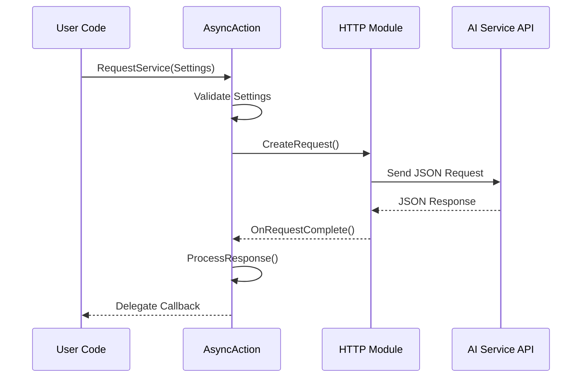

# API Integration Architecture

This document provides detailed technical documentation for the AI service API integration patterns, async action implementations, and data structure designs used throughout the UnrealGenAISupport plugin.

## Integration Patterns

### Async Action Pattern

All AI service integrations follow a consistent async action pattern based on `UCancellableAsyncAction`, providing both C++ and Blueprint compatibility with proper cancellation support.

#### Base Pattern Implementation

```cpp
// Base pattern for all AI service integrations
UCLASS()
class GENERATIVEAISUPPORT_API UGenAIServiceBase : public UCancellableAsyncAction
{
    GENERATED_BODY()

public:
    // Static function for native C++ integration
    static void SendRequest(const FServiceSettings& Settings, const FOnServiceResponse& OnComplete);

    // Blueprint async delegate
    UPROPERTY(BlueprintAssignable)
    FGenServiceDelegate OnComplete;

    // Blueprint latent function
    UFUNCTION(BlueprintCallable, meta = (BlueprintInternalUseOnly = "true", WorldContext = "WorldContextObject"), Category = "GenAI")
    static UGenAIServiceBase* RequestService(UObject* WorldContextObject, const FServiceSettings& Settings);

private:
    FServiceSettings Settings;
    
    // Shared implementation for both C++ and Blueprint paths
    static void MakeRequest(const FServiceSettings& Settings, const TFunction<void(const FString&, const FString&, bool)>& ResponseCallback);
    static void ProcessResponse(const FString& ResponseStr, const TFunction<void(const FString&, const FString&, bool)>& ResponseCallback);

protected:
    virtual void Activate() override;
    virtual void Cancel() override;
};
```

#### Implementation Flow



### Dual Delegate System

Each API integration implements both static C++ delegates and dynamic Blueprint delegates for maximum flexibility.

#### C++ Delegate Pattern
```cpp
// Static delegate for C++ integration - supports lambdas and function pointers
DECLARE_DELEGATE_ThreeParams(FOnChatCompletionResponse, const FString&, const FString&, bool);

// Usage in C++
UGenOAIChat::SendChatRequest(ChatSettings, 
    FOnChatCompletionResponse::CreateLambda([this](const FString& Response, const FString& Error, bool Success) {
        if (Success) {
            UE_LOG(LogTemp, Log, TEXT("AI Response: %s"), *Response);
        } else {
            UE_LOG(LogTemp, Error, TEXT("AI Error: %s"), *Error);
        }
    }));
```

#### Blueprint Delegate Pattern
```cpp
// Dynamic multicast delegate for Blueprint integration
DECLARE_DYNAMIC_MULTICAST_DELEGATE_ThreeParams(FGenChatCompletionDelegate, 
    const FString&, Response, 
    const FString&, Error, 
    bool, Success);

// Blueprint latent function implementation
UFUNCTION(BlueprintCallable, meta = (BlueprintInternalUseOnly = "true", WorldContext = "WorldContextObject"), Category = "GenAI")
static UGenOAIChat* RequestOpenAIChat(UObject* WorldContextObject, const FGenChatSettings& ChatSettings)
{
    UGenOAIChat* Action = NewObject<UGenOAIChat>();
    Action->ChatSettings = ChatSettings;
    Action->RegisterWithGameInstance(WorldContextObject);
    return Action;
}
```

## Service-Specific Implementations

### OpenAI Integration

#### Data Structures
```cpp
// OpenAI model enumeration with type safety
UENUM(BlueprintType)
enum class EGenOAIChatModel : uint8
{
    GPT_35_Turbo        UMETA(DisplayName = "GPT-3.5 Turbo"),
    GPT_4o              UMETA(DisplayName = "GPT-4o"),
    GPT_4o_Mini         UMETA(DisplayName = "GPT-4o Mini"),
    GPT_41              UMETA(DisplayName = "GPT-4.1"),
    GPT_41_Mini         UMETA(DisplayName = "GPT-4.1 Mini"),
    O3_Mini             UMETA(DisplayName = "O3 Mini"),
    O1                  UMETA(DisplayName = "O1"),
    Custom              UMETA(DisplayName = "Custom Model")
};

// Message structure with role-based content
USTRUCT(BlueprintType)
struct FGenChatMessage
{
    GENERATED_BODY()

    UPROPERTY(EditAnywhere, BlueprintReadWrite, Category = "GenAI|OpenAI")
    FString Role = TEXT("user");

    UPROPERTY(EditAnywhere, BlueprintReadWrite, Category = "GenAI|OpenAI")
    FString Content;

    FGenChatMessage() {}
    FGenChatMessage(const FString& InRole, const FString& InContent)
        : Role(InRole), Content(InContent) {}
};

// Comprehensive settings structure
USTRUCT(BlueprintType)
struct FGenChatSettings
{
    GENERATED_BODY()

    // Model selection with enum safety
    UPROPERTY(EditAnywhere, BlueprintReadWrite, Category = "GenAI|OpenAI")
    EGenOAIChatModel ModelEnum = EGenOAIChatModel::GPT_4o;
    
    // Custom model support
    UPROPERTY(EditAnywhere, BlueprintReadWrite, Category = "GenAI|OpenAI", 
              meta = (EditCondition = "ModelEnum == EGenOAIChatModel::Custom", EditConditionHides))
    FString CustomModel;

    // Token and conversation management
    UPROPERTY(EditAnywhere, BlueprintReadWrite, Category = "GenAI|OpenAI")
    int32 MaxTokens = 10000;

    UPROPERTY(EditAnywhere, BlueprintReadWrite, Category = "GenAI|OpenAI")
    TArray<FGenChatMessage> Messages;

    // Model string resolution
    void UpdateModel()
    {
        if (ModelEnum == EGenOAIChatModel::Custom && !CustomModel.IsEmpty())
        {
            Model = CustomModel;
        }
        else
        {
            Model = UGenOAIModelUtils::ChatModelToString(ModelEnum);
        }
    }

private:
    UPROPERTY(BlueprintReadOnly, Category = "GenAI|OpenAI")
    FString Model = TEXT("gpt-4o");
};
```

#### HTTP Request Implementation
```cpp
void UGenOAIChat::MakeRequest(const FGenChatSettings& ChatSettings, const TFunction<void(const FString&, const FString&, bool)>& ResponseCallback)
{
    // Get API key securely
    FString ApiKey = UGenSecureKey::GetGenAIApiKey(EGenAIOrganization::OpenAI);
    if (ApiKey.IsEmpty())
    {
        ResponseCallback(TEXT(""), TEXT("OpenAI API key not found"), false);
        return;
    }

    // Create HTTP request
    TSharedRef<IHttpRequest> HttpRequest = FHttpModule::Get().CreateRequest();
    HttpRequest->SetVerb(TEXT("POST"));
    HttpRequest->SetURL(TEXT("https://api.openai.com/v1/chat/completions"));
    
    // Set headers
    HttpRequest->SetHeader(TEXT("Content-Type"), TEXT("application/json"));
    HttpRequest->SetHeader(TEXT("Authorization"), FString::Printf(TEXT("Bearer %s"), *ApiKey));

    // Build JSON payload
    TSharedPtr<FJsonObject> JsonObject = MakeShareable(new FJsonObject);
    
    // Add model (ensure it's updated from enum)
    FGenChatSettings ModifiableSettings = ChatSettings;
    ModifiableSettings.UpdateModel();
    JsonObject->SetStringField(TEXT("model"), ModifiableSettings.Model);
    JsonObject->SetNumberField(TEXT("max_tokens"), ChatSettings.MaxTokens);

    // Convert messages to JSON array
    TArray<TSharedPtr<FJsonValue>> MessagesArray;
    for (const FGenChatMessage& Message : ChatSettings.Messages)
    {
        TSharedPtr<FJsonObject> MessageObj = MakeShareable(new FJsonObject);
        MessageObj->SetStringField(TEXT("role"), Message.Role);
        MessageObj->SetStringField(TEXT("content"), Message.Content);
        MessagesArray.Add(MakeShareable(new FJsonValueObject(MessageObj)));
    }
    JsonObject->SetArrayField(TEXT("messages"), MessagesArray);

    // Serialize and send
    FString OutputString;
    TSharedRef<TJsonWriter<>> Writer = TJsonWriterFactory<>::Create(&OutputString);
    FJsonSerializer::Serialize(JsonObject.ToSharedRef(), Writer);
    HttpRequest->SetContentAsString(OutputString);

    // Set response handler
    HttpRequest->OnProcessRequestComplete().BindLambda([ResponseCallback](FHttpRequestPtr Request, FHttpResponsePtr Response, bool bWasSuccessful)
    {
        if (!bWasSuccessful || !Response.IsValid())
        {
            ResponseCallback(TEXT(""), TEXT("Network error or invalid response"), false);
            return;
        }

        ProcessResponse(Response->GetContentAsString(), ResponseCallback);
    });

    // Execute request
    HttpRequest->ProcessRequest();
}
```

### Anthropic Claude Integration

#### Claude-Specific Data Structures
```cpp
// Claude model enumeration
UENUM(BlueprintType)
enum class EClaudeModels : uint8
{
    Claude_3_5_Sonnet       UMETA(DisplayName = "Claude 3.5 Sonnet"),
    Claude_3_5_Haiku        UMETA(DisplayName = "Claude 3.5 Haiku"),
    Claude_3_Opus           UMETA(DisplayName = "Claude 3 Opus"),
    Claude_Sonnet_4         UMETA(DisplayName = "Claude Sonnet 4"),
    Claude_Opus_4           UMETA(DisplayName = "Claude Opus 4"),
    Claude_3_7_Sonnet       UMETA(DisplayName = "Claude 3.7 Sonnet"),
    Custom                  UMETA(DisplayName = "Custom Model")
};

// Claude-specific settings
USTRUCT(BlueprintType)
struct FGenClaudeChatSettings
{
    GENERATED_BODY()

    UPROPERTY(EditAnywhere, BlueprintReadWrite, Category = "GenAI|Claude")
    EClaudeModels Model = EClaudeModels::Claude_3_5_Sonnet;
    
    UPROPERTY(EditAnywhere, BlueprintReadWrite, Category = "GenAI|Claude",
              meta = (EditCondition = "Model == EClaudeModels::Custom", EditConditionHides))
    FString CustomModel;

    UPROPERTY(EditAnywhere, BlueprintReadWrite, Category = "GenAI|Claude")
    int32 MaxTokens = 4096;

    UPROPERTY(EditAnywhere, BlueprintReadWrite, Category = "GenAI|Claude", meta = (ClampMin = "0.0", ClampMax = "1.0"))
    float Temperature = 0.7f;

    UPROPERTY(EditAnywhere, BlueprintReadWrite, Category = "GenAI|Claude")
    TArray<FGenChatMessage> Messages;

    // Claude-specific features
    UPROPERTY(EditAnywhere, BlueprintReadWrite, Category = "GenAI|Claude")
    FString SystemPrompt;

    UPROPERTY(EditAnywhere, BlueprintReadWrite, Category = "GenAI|Claude")
    bool bStopSequences = false;

    UPROPERTY(EditAnywhere, BlueprintReadWrite, Category = "GenAI|Claude",
              meta = (EditCondition = "bStopSequences", EditConditionHides))
    TArray<FString> StopSequences;
};
```

#### Claude API Implementation
```cpp
void UGenClaudeChat::MakeRequest(const FGenClaudeChatSettings& ChatSettings, const TFunction<void(const FString&, const FString&, bool)>& ResponseCallback)
{
    FString ApiKey = UGenSecureKey::GetGenAIApiKey(EGenAIOrganization::Anthropic);
    if (ApiKey.IsEmpty())
    {
        ResponseCallback(TEXT(""), TEXT("Anthropic API key not found"), false);
        return;
    }

    TSharedRef<IHttpRequest> HttpRequest = FHttpModule::Get().CreateRequest();
    HttpRequest->SetVerb(TEXT("POST"));
    HttpRequest->SetURL(TEXT("https://api.anthropic.com/v1/messages"));
    
    // Claude-specific headers
    HttpRequest->SetHeader(TEXT("Content-Type"), TEXT("application/json"));
    HttpRequest->SetHeader(TEXT("x-api-key"), ApiKey);
    HttpRequest->SetHeader(TEXT("anthropic-version"), TEXT("2023-06-01"));

    // Build Claude-specific JSON payload
    TSharedPtr<FJsonObject> JsonObject = MakeShareable(new FJsonObject);
    
    FString ModelString = UGenClaudeModelUtils::ModelToString(ChatSettings.Model);
    if (ChatSettings.Model == EClaudeModels::Custom && !ChatSettings.CustomModel.IsEmpty())
    {
        ModelString = ChatSettings.CustomModel;
    }
    
    JsonObject->SetStringField(TEXT("model"), ModelString);
    JsonObject->SetNumberField(TEXT("max_tokens"), ChatSettings.MaxTokens);
    JsonObject->SetNumberField(TEXT("temperature"), ChatSettings.Temperature);

    // Handle system prompt separately for Claude
    if (!ChatSettings.SystemPrompt.IsEmpty())
    {
        JsonObject->SetStringField(TEXT("system"), ChatSettings.SystemPrompt);
    }

    // Process messages (filter out system messages if system prompt is used)
    TArray<TSharedPtr<FJsonValue>> MessagesArray;
    for (const FGenChatMessage& Message : ChatSettings.Messages)
    {
        if (Message.Role != TEXT("system") || ChatSettings.SystemPrompt.IsEmpty())
        {
            TSharedPtr<FJsonObject> MessageObj = MakeShareable(new FJsonObject);
            MessageObj->SetStringField(TEXT("role"), Message.Role);
            MessageObj->SetStringField(TEXT("content"), Message.Content);
            MessagesArray.Add(MakeShareable(new FJsonValueObject(MessageObj)));
        }
    }
    JsonObject->SetArrayField(TEXT("messages"), MessagesArray);

    // Add stop sequences if specified
    if (ChatSettings.bStopSequences && ChatSettings.StopSequences.Num() > 0)
    {
        TArray<TSharedPtr<FJsonValue>> StopArray;
        for (const FString& Stop : ChatSettings.StopSequences)
        {
            StopArray.Add(MakeShareable(new FJsonValueString(Stop)));
        }
        JsonObject->SetArrayField(TEXT("stop_sequences"), StopArray);
    }

    // Send request with Claude-specific response processing
    FString OutputString;
    TSharedRef<TJsonWriter<>> Writer = TJsonWriterFactory<>::Create(&OutputString);
    FJsonSerializer::Serialize(JsonObject.ToSharedRef(), Writer);
    HttpRequest->SetContentAsString(OutputString);

    HttpRequest->OnProcessRequestComplete().BindLambda([ResponseCallback](FHttpRequestPtr Request, FHttpResponsePtr Response, bool bWasSuccessful)
    {
        if (!bWasSuccessful || !Response.IsValid())
        {
            ResponseCallback(TEXT(""), TEXT("Network error or invalid response"), false);
            return;
        }

        ProcessClaudeResponse(Response->GetContentAsString(), ResponseCallback);
    });

    HttpRequest->ProcessRequest();
}
```

### DeepSeek Integration

#### DeepSeek-Specific Features
```cpp
// DeepSeek model enumeration with reasoning support
UENUM(BlueprintType)
enum class EDeepSeekModels : uint8
{
    Chat            UMETA(DisplayName = "DeepSeek Chat (V3)"),
    Reasoner        UMETA(DisplayName = "DeepSeek R1 Reasoning"),
    Custom          UMETA(DisplayName = "Custom Model")
};

// DeepSeek settings with reasoning support
USTRUCT(BlueprintType)
struct FGenDSeekChatSettings
{
    GENERATED_BODY()

    UPROPERTY(EditAnywhere, BlueprintReadWrite, Category = "GenAI|DeepSeek")
    EDeepSeekModels Model = EDeepSeekModels::Chat;

    UPROPERTY(EditAnywhere, BlueprintReadWrite, Category = "GenAI|DeepSeek")
    int32 MaxTokens = 4096;

    UPROPERTY(EditAnywhere, BlueprintReadWrite, Category = "GenAI|DeepSeek")
    TArray<FGenChatMessage> Messages;

    // Reasoning-specific features
    UPROPERTY(EditAnywhere, BlueprintReadWrite, Category = "GenAI|DeepSeek")
    bool bStreamResponse = false;

    // Note: System messages are mandatory for reasoning model
    UPROPERTY(EditAnywhere, BlueprintReadWrite, Category = "GenAI|DeepSeek",
              meta = (EditCondition = "Model == EDeepSeekModels::Reasoner"))
    bool bRequireSystemMessage = true;
};
```

#### Timeout Configuration for Reasoning
```cpp
// Extended timeout handling for DeepSeek R1 reasoning model
void UGenDSeekChat::MakeRequest(const FGenDSeekChatSettings& ChatSettings, const TFunction<void(const FString&, const FString&, bool)>& ResponseCallback)
{
    // ... API key and request setup ...

    // Set extended timeout for reasoning model
    float TimeoutDuration = 30.0f; // Default
    if (ChatSettings.Model == EDeepSeekModels::Reasoner)
    {
        TimeoutDuration = 180.0f; // 3 minutes for reasoning
    }
    
    HttpRequest->SetTimeout(TimeoutDuration);
    
    // Validate system message requirement for reasoning
    if (ChatSettings.Model == EDeepSeekModels::Reasoner)
    {
        bool bHasSystemMessage = false;
        for (const FGenChatMessage& Message : ChatSettings.Messages)
        {
            if (Message.Role == TEXT("system"))
            {
                bHasSystemMessage = true;
                break;
            }
        }
        
        if (!bHasSystemMessage)
        {
            ResponseCallback(TEXT(""), TEXT("System message is required for DeepSeek reasoning model"), false);
            return;
        }
    }

    // ... continue with request processing ...
}
```

## Error Handling Patterns

### Comprehensive Error Processing
```cpp
void UGenOAIChat::ProcessResponse(const FString& ResponseStr, const TFunction<void(const FString&, const FString&, bool)>& ResponseCallback)
{
    // Parse JSON response
    TSharedPtr<FJsonObject> JsonObject;
    TSharedRef<TJsonReader<>> Reader = TJsonReaderFactory<>::Create(ResponseStr);
    
    if (!FJsonSerializer::Deserialize(Reader, JsonObject) || !JsonObject.IsValid())
    {
        ResponseCallback(TEXT(""), TEXT("Invalid JSON response from API"), false);
        return;
    }

    // Check for API errors
    if (JsonObject->HasField(TEXT("error")))
    {
        const TSharedPtr<FJsonObject> ErrorObject = JsonObject->GetObjectField(TEXT("error"));
        FString ErrorMessage = ErrorObject->GetStringField(TEXT("message"));
        FString ErrorType = ErrorObject->GetStringField(TEXT("type"));
        FString ErrorCode = ErrorObject->GetStringField(TEXT("code"));
        
        FString DetailedError = FString::Printf(TEXT("API Error [%s:%s]: %s"), 
                                                *ErrorType, *ErrorCode, *ErrorMessage);
        ResponseCallback(TEXT(""), DetailedError, false);
        return;
    }

    // Extract response content
    if (JsonObject->HasField(TEXT("choices")))
    {
        const TArray<TSharedPtr<FJsonValue>>* ChoicesArray;
        if (JsonObject->TryGetArrayField(TEXT("choices"), ChoicesArray) && ChoicesArray->Num() > 0)
        {
            const TSharedPtr<FJsonObject> FirstChoice = (*ChoicesArray)[0]->AsObject();
            if (FirstChoice.IsValid() && FirstChoice->HasField(TEXT("message")))
            {
                const TSharedPtr<FJsonObject> MessageObject = FirstChoice->GetObjectField(TEXT("message"));
                FString Content = MessageObject->GetStringField(TEXT("content"));
                
                ResponseCallback(Content, TEXT(""), true);
                return;
            }
        }
    }

    ResponseCallback(TEXT(""), TEXT("Unexpected response format from API"), false);
}
```

### HTTP Error Handling
```cpp
void HandleHttpResponse(FHttpRequestPtr Request, FHttpResponsePtr Response, bool bWasSuccessful, const TFunction<void(const FString&, const FString&, bool)>& ResponseCallback)
{
    if (!bWasSuccessful)
    {
        ResponseCallback(TEXT(""), TEXT("Network request failed"), false);
        return;
    }

    if (!Response.IsValid())
    {
        ResponseCallback(TEXT(""), TEXT("Invalid HTTP response"), false);
        return;
    }

    int32 ResponseCode = Response->GetResponseCode();
    
    // Handle HTTP status codes
    switch (ResponseCode)
    {
        case 200:
            // Success - process response
            ProcessResponse(Response->GetContentAsString(), ResponseCallback);
            break;
            
        case 400:
            ResponseCallback(TEXT(""), TEXT("Bad Request: Invalid request parameters"), false);
            break;
            
        case 401:
            ResponseCallback(TEXT(""), TEXT("Unauthorized: Invalid or missing API key"), false);
            break;
            
        case 429:
            ResponseCallback(TEXT(""), TEXT("Rate Limited: Too many requests"), false);
            break;
            
        case 500:
            ResponseCallback(TEXT(""), TEXT("Internal Server Error: API service error"), false);
            break;
            
        default:
            FString ErrorMsg = FString::Printf(TEXT("HTTP Error %d: %s"), 
                                               ResponseCode, *Response->GetContentAsString());
            ResponseCallback(TEXT(""), ErrorMsg, false);
            break;
    }
}
```

## Blueprint Integration Patterns

### Latent Function Implementation
```cpp
// Blueprint latent function with proper world context handling
UFUNCTION(BlueprintCallable, meta = (BlueprintInternalUseOnly = "true", WorldContext = "WorldContextObject"), Category = "GenAI")
static UGenOAIChat* RequestOpenAIChat(UObject* WorldContextObject, const FGenChatSettings& ChatSettings)
{
    UGenOAIChat* Action = NewObject<UGenOAIChat>();
    Action->ChatSettings = ChatSettings;
    Action->RegisterWithGameInstance(WorldContextObject);
    
    // Validate settings before proceeding
    if (!Action->ValidateSettings())
    {
        // Trigger immediate callback with error
        FTimerHandle TimerHandle;
        Action->GetWorld()->GetTimerManager().SetTimerForNextTick([Action]()
        {
            Action->OnComplete.Broadcast(TEXT(""), TEXT("Invalid chat settings"), false);
            Action->SetReadyToDestroy();
        });
    }
    
    return Action;
}

// Activation with proper error handling
void UGenOAIChat::Activate()
{
    Super::Activate();
    
    if (!ValidateSettings())
    {
        OnComplete.Broadcast(TEXT(""), TEXT("Invalid settings"), false);
        SetReadyToDestroy();
        return;
    }

    MakeRequest(ChatSettings, [this](const FString& Response, const FString& Error, bool Success)
    {
        // Ensure we're still valid before broadcasting
        if (IsValid(this))
        {
            OnComplete.Broadcast(Response, Error, Success);
            SetReadyToDestroy();
        }
    });
}
```

### Settings Validation
```cpp
bool UGenOAIChat::ValidateSettings() const
{
    // Validate model selection
    if (ChatSettings.ModelEnum == EGenOAIChatModel::Custom && ChatSettings.CustomModel.IsEmpty())
    {
        UE_LOG(LogTemp, Error, TEXT("Custom model selected but no custom model name provided"));
        return false;
    }

    // Validate messages
    if (ChatSettings.Messages.Num() == 0)
    {
        UE_LOG(LogTemp, Error, TEXT("No messages provided for chat request"));
        return false;
    }

    // Validate token limits
    if (ChatSettings.MaxTokens <= 0 || ChatSettings.MaxTokens > 128000)
    {
        UE_LOG(LogTemp, Error, TEXT("Invalid max tokens: %d"), ChatSettings.MaxTokens);
        return false;
    }

    // Validate API key availability
    FString ApiKey = UGenSecureKey::GetGenAIApiKey(EGenAIOrganization::OpenAI);
    if (ApiKey.IsEmpty())
    {
        UE_LOG(LogTemp, Error, TEXT("OpenAI API key not found"));
        return false;
    }

    return true;
}
```

## Performance Optimizations

### Memory Management
```cpp
// Efficient JSON handling with shared pointers
class FGenAIJsonHelper
{
public:
    static TSharedPtr<FJsonObject> CreateMessageObject(const FGenChatMessage& Message)
    {
        TSharedPtr<FJsonObject> MessageObj = MakeShareable(new FJsonObject);
        MessageObj->SetStringField(TEXT("role"), Message.Role);
        MessageObj->SetStringField(TEXT("content"), Message.Content);
        return MessageObj;
    }

    static TArray<TSharedPtr<FJsonValue>> ConvertMessagesToJsonArray(const TArray<FGenChatMessage>& Messages)
    {
        TArray<TSharedPtr<FJsonValue>> MessagesArray;
        MessagesArray.Reserve(Messages.Num()); // Pre-allocate for performance
        
        for (const FGenChatMessage& Message : Messages)
        {
            MessagesArray.Add(MakeShareable(new FJsonValueObject(CreateMessageObject(Message))));
        }
        
        return MessagesArray;
    }
};
```

### Request Pooling
```cpp
// HTTP request optimization with connection reuse
class FGenAIHttpManager
{
private:
    static constexpr int32 MaxConcurrentRequests = 5;
    static TArray<TSharedPtr<IHttpRequest>> RequestPool;
    
public:
    static TSharedRef<IHttpRequest> GetRequest()
    {
        // Reuse existing request if available
        for (int32 i = RequestPool.Num() - 1; i >= 0; --i)
        {
            if (RequestPool[i]->GetStatus() == EHttpRequestStatus::NotStarted)
            {
                TSharedRef<IHttpRequest> Request = RequestPool[i].ToSharedRef();
                RequestPool.RemoveAt(i);
                return Request;
            }
        }
        
        // Create new request if pool is empty
        return FHttpModule::Get().CreateRequest();
    }
    
    static void ReturnRequest(TSharedPtr<IHttpRequest> Request)
    {
        if (Request.IsValid() && RequestPool.Num() < MaxConcurrentRequests)
        {
            Request->Reset(); // Reset for reuse
            RequestPool.Add(Request);
        }
    }
};
```

---

The API integration architecture provides a robust, scalable, and maintainable foundation for integrating multiple AI services while maintaining consistent patterns and high performance. The dual delegate system ensures maximum flexibility for both C++ and Blueprint developers, while comprehensive error handling and validation provide reliability in production environments.