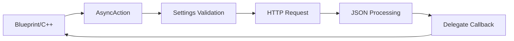

# Core Components

This document provides detailed technical documentation for the core components of the UnrealGenAISupport plugin, covering the dual-module architecture, dependencies, and implementation details.

## Module Architecture

### Runtime Module (GenerativeAISupport)

The runtime module provides production-ready AI API integrations with full Blueprint support. It's designed to be lightweight and efficient for packaged builds.

#### Module Definition
```cpp
// GenerativeAISupport.Build.cs
public class GenerativeAISupport : ModuleRules
{
    public GenerativeAISupport(ReadOnlyTargetRules Target) : base(Target)
    {
        PCHUsage = ModuleRules.PCHUsageMode.UseExplicitOrSharedPCHs;

        PublicDependencyModuleNames.AddRange(new string[]
        {
            "Core",              // Fundamental Unreal types and utilities
            "CoreUObject",       // UObject system and reflection
            "Engine",            // Core engine functionality
            "HTTP",              // HTTP request handling
            "Json",              // JSON serialization/deserialization
            "DeveloperSettings", // Plugin settings management
            "ImageDownload"      // Image handling for future vision APIs
        });

        PrivateDependencyModuleNames.AddRange(new string[]
        {
            "Slate",             // UI framework
            "SlateCore"          // Core UI functionality
        });
    }
}
```

#### Key Components

##### 1. API Integration Classes

**OpenAI Integration (`UGenOAIChat`)**
```cpp
// Source/GenerativeAISupport/Public/Models/OpenAI/GenOAIChat.h
UCLASS()
class GENERATIVEAISUPPORT_API UGenOAIChat : public UCancellableAsyncAction
{
    GENERATED_BODY()

public:
    // Static function for native C++ integration
    static void SendChatRequest(const FGenChatSettings& ChatSettings, const FOnChatCompletionResponse& OnComplete);

    // Blueprint async delegate
    UPROPERTY(BlueprintAssignable)
    FGenChatCompletionDelegate OnComplete;

    // Blueprint latent function
    UFUNCTION(BlueprintCallable, meta = (BlueprintInternalUseOnly = "true", WorldContext = "WorldContextObject"), Category = "GenAI")
    static UGenOAIChat* RequestOpenAIChat(UObject* WorldContextObject, const FGenChatSettings& ChatSettings);

private:
    // Shared implementation for both C++ and Blueprint paths
    static void MakeRequest(const FGenChatSettings& ChatSettings, const TFunction<void(const FString&, const FString&, bool)>& ResponseCallback);
};
```

**Anthropic Integration (`UGenClaudeChat`)**
```cpp
// Source/GenerativeAISupport/Public/Models/Anthropic/GenClaudeChat.h
UCLASS()
class GENERATIVEAISUPPORT_API UGenClaudeChat : public UCancellableAsyncAction
{
    GENERATED_BODY()
    
public:
    // Static function for native C++
    static void SendChatRequest(const FGenClaudeChatSettings& ChatSettings, const FOnClaudeChatCompletionResponse& OnComplete);

    // Blueprint async function
    UPROPERTY(BlueprintAssignable)
    FGenClaudeChatCompletionDelegate OnComplete;

    // Blueprint latent function
    UFUNCTION(BlueprintCallable, meta = (BlueprintInternalUseOnly = "true", WorldContext = "WorldContextObject"), Category = "GenAI|Claude")
    static UGenClaudeChat* RequestClaudeChat(UObject* WorldContextObject, const FGenClaudeChatSettings& ChatSettings);
};
```

##### 2. Data Structures

**OpenAI Data Structures**
```cpp
// Source/GenerativeAISupport/Public/Data/OpenAI/GenOAIChatStructs.h
USTRUCT(BlueprintType)
struct FGenChatMessage
{
    GENERATED_BODY()

    UPROPERTY(EditAnywhere, BlueprintReadWrite, Category = "GenAI|OpenAI")
    FString Role = TEXT("user");

    UPROPERTY(EditAnywhere, BlueprintReadWrite, Category = "GenAI|OpenAI")
    FString Content;
};

USTRUCT(BlueprintType)
struct FGenChatSettings
{
    GENERATED_BODY()

    // Model selection using enum for type safety
    UPROPERTY(EditAnywhere, BlueprintReadWrite, Category = "GenAI|OpenAI")
    EGenOAIChatModel ModelEnum = EGenOAIChatModel::GPT_35_Turbo;
    
    // Custom model support
    UPROPERTY(EditAnywhere, BlueprintReadWrite, Category = "GenAI|OpenAI", meta = (EditCondition = "ModelEnum == EGenOAIChatModel::Custom", EditConditionHides))
    FString CustomModel;

    UPROPERTY(EditAnywhere, BlueprintReadWrite, Category = "GenAI|OpenAI")
    int32 MaxTokens = 10000;

    UPROPERTY(EditAnywhere, BlueprintReadWrite, Category = "GenAI|OpenAI")
    TArray<FGenChatMessage> Messages;

    // Helper function to ensure correct model string
    void UpdateModel()
    {
        if (ModelEnum == EGenOAIChatModel::Custom && !CustomModel.IsEmpty())
        {
            Model = CustomModel;
        }
        else
        {
            Model = UGenOAIModelUtils::ChatModelToString(ModelEnum);
        }
    }
};
```

##### 3. Security Manager

**API Key Management (`UGenSecureKey`)**
```cpp
// Source/GenerativeAISupport/Public/Secure/GenSecureKey.h
UCLASS(BlueprintType)
class GENERATIVEAISUPPORT_API UGenSecureKey : public UBlueprintFunctionLibrary
{
    GENERATED_BODY()

public:
    // Get API key from environment variables
    UFUNCTION(BlueprintCallable, Category = "GenAI|Security")
    static FString GetGenAIApiKey(EGenAIOrganization Organization);

    // Set API key at runtime (for packaged builds)
    UFUNCTION(BlueprintCallable, Category = "GenAI|Security")
    static void SetGenAIApiKeyRuntime(EGenAIOrganization Organization, const FString& ApiKey);

    // Validate API key format
    UFUNCTION(BlueprintCallable, Category = "GenAI|Security")
    static bool ValidateApiKeyFormat(EGenAIOrganization Organization, const FString& ApiKey);
};
```

### Editor Module (GenerativeAISupportEditor)

The editor module provides development tools and MCP functionality for AI-controlled Unreal Engine automation.

#### Module Definition
```cpp
// GenerativeAISupportEditor.Build.cs
public class GenerativeAISupportEditor : ModuleRules
{
    public GenerativeAISupportEditor(ReadOnlyTargetRules Target) : base(Target)
    {
        PCHUsage = ModuleRules.PCHUsageMode.UseExplicitOrSharedPCHs;

        PublicDependencyModuleNames.AddRange(new string[]
        {
            "Core",
            "CoreUObject", 
            "Engine",
            "GenerativeAISupport",  // Depend on runtime module
            "Json",
            "JsonUtilities"
        });

        PrivateDependencyModuleNames.AddRange(new string[]
        {
            "UnrealEd",                  // Editor framework
            "Slate", "SlateCore",        // UI framework
            "EditorStyle",               // Editor styling
            "WorkspaceMenuStructure",    // Menu integration
            "Projects",                  // Project management
            "EditorScriptingUtilities",  // Editor scripting
            "Blutility",                 // Blueprint utilities
            "MaterialEditor",            // Material editing
            "MaterialUtilities",         // Material utilities
            "BlueprintGraph",            // Blueprint graph editing
            "UMGEditor",                 // UMG widget editing
            "UMG",                       // UMG runtime
            "Settings",                  // Settings framework
            "FunctionalTesting",         // Automation testing
            "SourceControl"              // Version control
        });
    }
}
```

#### Key Components

##### 1. Blueprint Utilities

**Blueprint Management (`UGenBlueprintUtils`)**
```cpp
// Source/GenerativeAISupportEditor/Public/MCP/GenBlueprintUtils.h
UCLASS(BlueprintType)
class GENERATIVEAISUPPORTEDITOR_API UGenBlueprintUtils : public UBlueprintFunctionLibrary
{
    GENERATED_BODY()

public:
    // Blueprint creation and management
    UFUNCTION(BlueprintCallable, Category = "GenAI|Blueprint", CallInEditor = true)
    static UBlueprint* CreateBlueprint(const FString& BlueprintName, const FString& ParentClass, const FString& SavePath);

    UFUNCTION(BlueprintCallable, Category = "GenAI|Blueprint", CallInEditor = true) 
    static bool AddComponent(const FString& BlueprintPath, const FString& ComponentClass, const FString& ComponentName);

    UFUNCTION(BlueprintCallable, Category = "GenAI|Blueprint", CallInEditor = true)
    static bool AddVariable(const FString& BlueprintPath, const FString& VariableName, const FString& VariableType, const FString& DefaultValue, const FString& Category);

    UFUNCTION(BlueprintCallable, Category = "GenAI|Blueprint", CallInEditor = true)
    static FString AddFunction(const FString& BlueprintPath, const FString& FunctionName, const FString& InputsJson, const FString& OutputsJson);

    // Node connection and management
    UFUNCTION(BlueprintCallable, Category = "GenAI|Blueprint", CallInEditor = true)
    static FString ConnectNodes(const FString& BlueprintPath, const FString& FunctionId, const FString& SourceNodeId, const FString& SourcePin, const FString& TargetNodeId, const FString& TargetPin);

    UFUNCTION(BlueprintCallable, Category = "GenAI|Blueprint", CallInEditor = true)
    static bool CompileBlueprint(const FString& BlueprintPath);
};
```

**Node Creation (`UGenBlueprintNodeCreator`)**
```cpp
// Source/GenerativeAISupportEditor/Public/MCP/GenBlueprintNodeCreator.h
UCLASS(BlueprintType)
class GENERATIVEAISUPPORTEDITOR_API UGenBlueprintNodeCreator : public UBlueprintFunctionLibrary
{
    GENERATED_BODY()

public:
    // Individual node operations
    UFUNCTION(BlueprintCallable, Category = "GenAI|Blueprint|Nodes", CallInEditor = true)
    static FString AddNode(const FString& BlueprintPath, const FString& FunctionId, const FString& NodeType, float PosX, float PosY, const FString& NodePropertiesJson);

    UFUNCTION(BlueprintCallable, Category = "GenAI|Blueprint|Nodes", CallInEditor = true)
    static bool DeleteNode(const FString& BlueprintPath, const FString& FunctionId, const FString& NodeId);

    // Bulk operations for performance
    UFUNCTION(BlueprintCallable, Category = "GenAI|Blueprint|Nodes", CallInEditor = true)
    static FString AddNodesBulk(const FString& BlueprintPath, const FString& FunctionId, const FString& NodesJson);

    // Node discovery and suggestions
    UFUNCTION(BlueprintCallable, Category = "GenAI|Blueprint|Nodes", CallInEditor = true)
    static FString GetNodeSuggestions(const FString& NodeType);

    UFUNCTION(BlueprintCallable, Category = "GenAI|Blueprint|Nodes", CallInEditor = true)
    static FString GetAllNodesInGraph(const FString& BlueprintPath, const FString& FunctionId);
};
```

##### 2. Scene Control

**Actor Management (`UGenActorUtils`)**
```cpp
// Source/GenerativeAISupportEditor/Public/MCP/GenActorUtils.h
UCLASS(BlueprintType)
class GENERATIVEAISUPPORTEDITOR_API UGenActorUtils : public UBlueprintFunctionLibrary
{
    GENERATED_BODY()

public:
    // Actor spawning and manipulation
    UFUNCTION(BlueprintCallable, Category = "GenAI|Scene", CallInEditor = true)
    static AActor* SpawnActor(const FString& ActorClass, FVector Location, FRotator Rotation, FVector Scale, const FString& ActorLabel);

    UFUNCTION(BlueprintCallable, Category = "GenAI|Scene", CallInEditor = true)
    static bool SetActorTransform(const FString& ActorName, FVector Location, FRotator Rotation, FVector Scale);

    // Material creation and assignment
    UFUNCTION(BlueprintCallable, Category = "GenAI|Scene", CallInEditor = true)
    static FString CreateMaterial(const FString& MaterialName, FLinearColor Color);

    UFUNCTION(BlueprintCallable, Category = "GenAI|Scene", CallInEditor = true)
    static bool AssignMaterial(const FString& ActorName, const FString& MaterialPath);

    // Scene querying
    UFUNCTION(BlueprintCallable, Category = "GenAI|Scene", CallInEditor = true)
    static TArray<AActor*> GetAllSceneActors();
};
```

##### 3. Widget Management

**UI Widget Control (`UGenWidgetUtils`)**
```cpp
// Source/GenerativeAISupportEditor/Public/MCP/GenWidgetUtils.h
UCLASS(BlueprintType)
class GENERATIVEAISUPPORTEDITOR_API UGenWidgetUtils : public UBlueprintFunctionLibrary
{
    GENERATED_BODY()

public:
    // Widget creation and management
    UFUNCTION(BlueprintCallable, Category = "GenAI|UI", CallInEditor = true)
    static FString AddWidgetToUserWidget(const FString& UserWidgetPath, const FString& WidgetType, const FString& WidgetName, const FString& ParentWidgetName);

    UFUNCTION(BlueprintCallable, Category = "GenAI|UI", CallInEditor = true)
    static FString EditWidgetProperty(const FString& UserWidgetPath, const FString& WidgetName, const FString& PropertyName, const FString& Value);

    // UI Blueprint creation
    UFUNCTION(BlueprintCallable, Category = "GenAI|UI", CallInEditor = true)
    static UWidgetBlueprint* CreateWidgetBlueprint(const FString& WidgetName, const FString& SavePath);
};
```

## Component Interactions

### Runtime Component Flow


### Editor Component Flow


## Performance Characteristics

### Runtime Module Performance
- **Memory Usage**: Minimal runtime overhead, USTRUCT-based data
- **CPU Usage**: Async operations prevent main thread blocking
- **Network**: Efficient JSON serialization, configurable timeouts
- **Threading**: All API calls on background threads

### Editor Module Performance
- **Editor Responsiveness**: MCP operations on separate thread
- **Asset Operations**: Batched operations for efficiency
- **Memory Management**: Proper cleanup and garbage collection
- **Socket Performance**: Optimized JSON communication

## Configuration and Settings

### Plugin Settings
```cpp
// Source/GenerativeAISupportEditor/Public/GenerativeAISupportSettings.h
UCLASS(config=GenerativeAISupport, defaultconfig, Category = "GenerativeAI")
class GENERATIVEAISUPPORTEDITOR_API UGenerativeAISupportSettings : public UDeveloperSettings
{
    GENERATED_BODY()

public:
    // MCP Server settings
    UPROPERTY(EditAnywhere, config, Category = "MCP")
    bool bAutoStartMCPServer = false;

    UPROPERTY(EditAnywhere, config, Category = "MCP")
    int32 MCPServerPort = 9877;

    UPROPERTY(EditAnywhere, config, Category = "MCP")
    FString MCPServerHost = TEXT("localhost");

    // API settings
    UPROPERTY(EditAnywhere, config, Category = "API")
    float DefaultRequestTimeout = 30.0f;

    UPROPERTY(EditAnywhere, config, Category = "API")
    int32 MaxRetryAttempts = 3;

    // Development settings
    UPROPERTY(EditAnywhere, config, Category = "Development")
    bool bEnableDetailedLogging = false;

    UPROPERTY(EditAnywhere, config, Category = "Development")
    bool bEnableMCPDebugging = false;
};
```

## Error Handling and Logging

### Runtime Error Handling
```cpp
// Example error handling pattern
static void ProcessResponse(const FString& ResponseStr, const TFunction<void(const FString&, const FString&, bool)>& ResponseCallback)
{
    TSharedPtr<FJsonObject> JsonObject;
    TSharedRef<TJsonReader<>> Reader = TJsonReaderFactory<>::Create(ResponseStr);
    
    if (!FJsonSerializer::Deserialize(Reader, JsonObject) || !JsonObject.IsValid())
    {
        ResponseCallback(TEXT(""), TEXT("Invalid JSON response"), false);
        return;
    }

    if (JsonObject->HasField(TEXT("error")))
    {
        const TSharedPtr<FJsonObject> ErrorObject = JsonObject->GetObjectField(TEXT("error"));
        FString ErrorMessage = ErrorObject->GetStringField(TEXT("message"));
        ResponseCallback(TEXT(""), ErrorMessage, false);
        return;
    }

    // Process successful response...
    ResponseCallback(ProcessedResponse, TEXT(""), true);
}
```

### Editor Error Handling
```cpp
// Example MCP error handling
try 
{
    // Execute editor operation
    UBlueprint* Blueprint = CreateBlueprint(BlueprintName, ParentClass, SavePath);
    if (!Blueprint)
    {
        return FString::Printf(TEXT("{\"success\": false, \"error\": \"Failed to create blueprint %s\"}"), *BlueprintName);
    }
    
    return FString::Printf(TEXT("{\"success\": true, \"blueprint_path\": \"%s\"}"), *Blueprint->GetPathName());
}
catch (const std::exception& e)
{
    return FString::Printf(TEXT("{\"success\": false, \"error\": \"Exception: %s\"}"), *FString(e.what()));
}
```

---

This completes the core components documentation. The dual-module architecture provides a clean separation between production-ready runtime functionality and powerful editor-time development tools, enabling both efficient runtime performance and comprehensive AI-controlled automation capabilities.