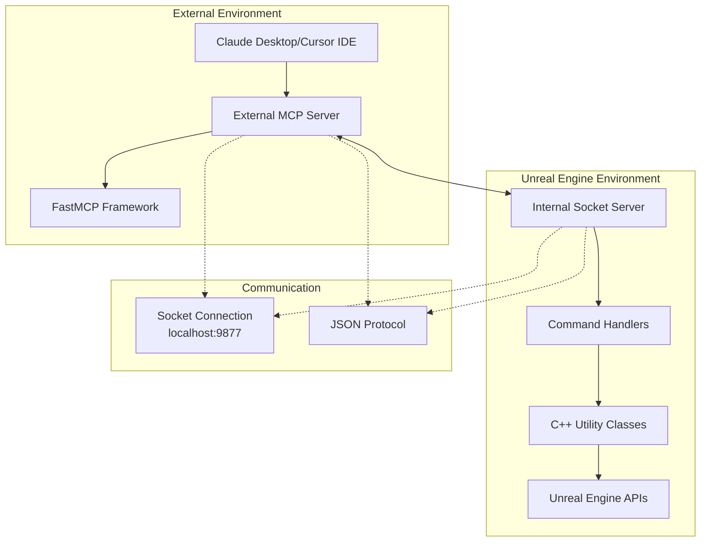
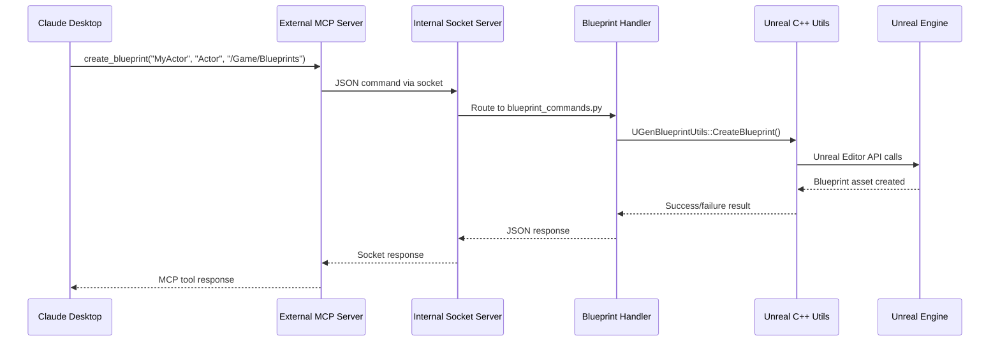

# MCP System Architecture

This document provides comprehensive technical documentation for the Model Control Protocol (MCP) system implementation in UnrealGenAISupport, covering the dual-server architecture, communication protocols, and command handling system.

## Overview

The MCP system enables AI assistants (like Claude Desktop and Cursor IDE) to directly control Unreal Engine through a sophisticated dual-server architecture. This revolutionary approach allows AI to manipulate scenes, create Blueprints, manage assets, and execute Python scripts within Unreal Engine.

## Dual-Server Architecture

### Architecture Diagram



### External MCP Server (mcp_server.py)

**Location**: `Content/Python/mcp_server.py`  
**Framework**: FastMCP  
**Purpose**: Interface between AI clients and Unreal Engine

#### Key Features
- **Client Support**: Claude Desktop App, Cursor IDE integration
- **Tool Registration**: 40+ MCP tools for comprehensive Unreal control
- **Process Management**: PID file tracking and cleanup
- **Safety Mechanisms**: Destructive operation validation

#### Server Implementation
```python
# Core server setup
from mcp.server.fastmcp import FastMCP
import socket
import json
import os
from pathlib import Path

# Create MCP server instance
mcp = FastMCP("UnrealHandshake")

# PID file management for process tracking
def write_pid_file():
    try:
        pid = os.getpid()
        pid_dir = os.path.join(os.path.expanduser("~"), ".unrealgenai")
        os.makedirs(pid_dir, exist_ok=True)
        pid_path = os.path.join(pid_dir, "mcp_server.pid")

        with open(pid_path, "w") as f:
            f.write(f"{pid}\n9877")  # Store PID and port

        import atexit
        def cleanup_pid_file():
            try:
                if os.path.exists(pid_path):
                    os.remove(pid_path)
            except:
                pass
        atexit.register(cleanup_pid_file)
        return pid_path
    except Exception as e:
        print(f"Failed to write PID file: {e}", file=sys.stderr)
        return None
```

#### Socket Communication
```python
def send_to_unreal(command):
    """Send JSON command to Unreal Engine internal server"""
    with socket.socket(socket.AF_INET, socket.SOCK_STREAM) as s:
        try:
            s.connect(('localhost', 9877))  # Unreal listens on port 9877
            
            # Ensure proper JSON encoding
            json_str = json.dumps(command)
            s.sendall(json_str.encode('utf-8'))
            
            # Robust response handling
            buffer_size = 8192
            response_data = b""
            
            # Keep receiving data until complete JSON
            while True:
                chunk = s.recv(buffer_size)
                if not chunk:
                    break
                    
                response_data += chunk
                
                # Check if we have complete JSON
                try:
                    json.loads(response_data.decode('utf-8'))
                    break  # Valid JSON received
                except json.JSONDecodeError:
                    continue  # Need more data
            
            if response_data:
                return json.loads(response_data.decode('utf-8'))
            else:
                return {"success": False, "error": "No response received"}
                
        except Exception as e:
            return {"success": False, "error": str(e)}
```

### Internal Socket Server (unreal_socket_server.py)

**Location**: `Content/Python/unreal_socket_server.py`  
**Purpose**: Receive MCP commands and execute within Unreal Engine Python environment

#### Server Implementation
```python
import socket
import json
import threading
import unreal
from handlers import (
    basic_commands,
    blueprint_commands, 
    actor_commands,
    ui_commands,
    python_commands
)

class UnrealSocketServer:
    def __init__(self, host='localhost', port=9877):
        self.host = host
        self.port = port
        self.socket = None
        self.running = False
        
    def start_server(self):
        """Start the socket server for MCP communication"""
        try:
            self.socket = socket.socket(socket.AF_INET, socket.SOCK_STREAM)
            self.socket.setsockopt(socket.SOL_SOCKET, socket.SO_REUSEADDR, 1)
            self.socket.bind((self.host, self.port))
            self.socket.listen(5)
            self.running = True
            
            print(f"Unreal MCP Server listening on {self.host}:{self.port}")
            
            while self.running:
                try:
                    client_socket, address = self.socket.accept()
                    client_thread = threading.Thread(
                        target=self.handle_client,
                        args=(client_socket, address)
                    )
                    client_thread.daemon = True
                    client_thread.start()
                    
                except socket.error as e:
                    if self.running:
                        print(f"Socket error: {e}")
                        
        except Exception as e:
            print(f"Failed to start server: {e}")
            
    def handle_client(self, client_socket, address):
        """Handle individual client connections"""
        try:
            with client_socket:
                # Receive JSON command
                data = client_socket.recv(8192).decode('utf-8')
                if not data:
                    return
                    
                # Parse and route command
                try:
                    command = json.loads(data)
                    response = self.route_command(command)
                except json.JSONDecodeError:
                    response = {"success": False, "error": "Invalid JSON"}
                
                # Send response back
                response_json = json.dumps(response)
                client_socket.sendall(response_json.encode('utf-8'))
                
        except Exception as e:
            error_response = {"success": False, "error": str(e)}
            try:
                client_socket.sendall(json.dumps(error_response).encode('utf-8'))
            except:
                pass
                
    def route_command(self, command):
        """Route command to appropriate handler"""
        command_type = command.get("type", "")
        
        # Route to appropriate handler module
        if command_type in ["spawn", "create_material"]:
            return basic_commands.handle_command(command)
        elif command_type.startswith("blueprint") or command_type in ["create_blueprint", "add_component", "add_variable", "add_function", "add_node", "connect_nodes", "compile_blueprint"]:
            return blueprint_commands.handle_command(command)
        elif command_type in ["edit_component_property"]:
            return actor_commands.handle_command(command)
        elif command_type in ["add_widget_to_user_widget", "edit_widget_property"]:
            return ui_commands.handle_command(command)
        elif command_type in ["execute_python", "execute_unreal_command"]:
            return python_commands.handle_command(command)
        else:
            return {"success": False, "error": f"Unknown command type: {command_type}"}
```

## Command Handler System

### Handler Organization

Commands are organized into specialized handler modules based on functionality:

#### 1. Basic Commands (`basic_commands.py`)
- **Object Spawning**: Actors, primitives, lights
- **Material Creation**: Basic material creation and assignment
- **Scene Control**: Object manipulation and transformation

#### 2. Blueprint Commands (`blueprint_commands.py`)
- **Blueprint Creation**: New Blueprint assets from parent classes
- **Component Management**: Adding components to Blueprints
- **Variable/Function Management**: Blueprint variables and functions
- **Node Operations**: Blueprint graph node creation and connection

#### 3. Actor Commands (`actor_commands.py`)
- **Component Property Editing**: Scene actor component properties
- **Transform Management**: Position, rotation, scale modifications
- **Asset Assignment**: Material and mesh assignments

#### 4. UI Commands (`ui_commands.py`)
- **Widget Creation**: UMG widget creation and management
- **Property Editing**: Widget property modifications
- **Layout Management**: Widget hierarchy and positioning

#### 5. Python Commands (`python_commands.py`)
- **Script Execution**: Safe Python script execution
- **Console Commands**: Unreal Engine console command execution
- **Development Tools**: Debugging and utility commands

### Command Flow Example

#### Blueprint Creation Flow


### Command Protocol

#### Command Structure
```json
{
    "type": "command_type",
    "parameter1": "value1",
    "parameter2": "value2",
    "...": "..."
}
```

#### Response Structure
```json
{
    "success": true/false,
    "message": "descriptive message",
    "data": {...},
    "error": "error description if failed"
}
```

## Tool Definitions

### Blueprint Tools

#### Create Blueprint
```python
@mcp.tool()
def create_blueprint(blueprint_name: str, parent_class: str = "Actor", save_path: str = "/Game/Blueprints") -> str:
    """
    Create a new Blueprint class
    
    Args:
        blueprint_name: Name for the new Blueprint
        parent_class: Parent class name or path (e.g., "Actor", "/Script/Engine.Actor")
        save_path: Path to save the Blueprint asset
        
    Returns:
        Message indicating success or failure
    """
    command = {
        "type": "create_blueprint",
        "blueprint_name": blueprint_name,
        "parent_class": parent_class,
        "save_path": save_path
    }
    
    response = send_to_unreal(command)
    if response.get("success"):
        return f"Successfully created Blueprint '{blueprint_name}' with path: {response.get('blueprint_path', save_path + '/' + blueprint_name)}"
    else:
        return f"Failed to create Blueprint: {response.get('error', 'Unknown error')}"
```

#### Add Node to Blueprint
```python
@mcp.tool()
def add_node_to_blueprint(blueprint_path: str, function_id: str, node_type: str,
                          node_position: list = [0, 0], node_properties: dict = None) -> str:
    """
    Add a node to a Blueprint graph
    
    Args:
        blueprint_path: Path to the Blueprint asset
        function_id: ID of the function to add the node to
        node_type: Type of node to add (e.g., "ReturnNode", "Branch", "PrintString")
        node_position: Position [X, Y] - space nodes 400+ units apart
        node_properties: Properties to set on the node (optional)
    
    Returns:
        On success: The node ID (GUID)
        On failure: Error message with suggestions for alternative node types
    """
    if node_properties is None:
        node_properties = {}

    command = {
        "type": "add_node",
        "blueprint_path": blueprint_path,
        "function_id": function_id,
        "node_type": node_type,
        "node_position": node_position,
        "node_properties": node_properties
    }

    response = send_to_unreal(command)
    if response.get("success"):
        return f"Successfully added {node_type} node with ID: {response.get('node_id', 'unknown')}"
    else:
        return f"Failed to add node: {response.get('error', 'Unknown error')}"
```

### Scene Control Tools

#### Spawn Object
```python
@mcp.tool()
def spawn_object(actor_class: str, location: list = [0, 0, 0], rotation: list = [0, 0, 0],
                 scale: list = [1, 1, 1], actor_label: str = None) -> str:
    """
    Spawn an object in the Unreal Engine level
    
    Args:
        actor_class: For basic shapes: "Cube", "Sphere", "Cylinder", "Cone"
                     For other actors: class name like "PointLight" or full path
        location: [X, Y, Z] coordinates
        rotation: [Pitch, Yaw, Roll] in degrees
        scale: [X, Y, Z] scale factors
        actor_label: Optional custom name for the actor
        
    Returns:
        Message indicating success or failure
    """
    command = {
        "type": "spawn",
        "actor_class": actor_class,
        "location": location,
        "rotation": rotation,
        "scale": scale,
        "actor_label": actor_label
    }

    response = send_to_unreal(command)
    if response.get("success"):
        return f"Successfully spawned {actor_class}" + (f" with label '{actor_label}'" if actor_label else "")
    else:
        error = response.get('error', 'Unknown error')
        if "not found" in error:
            hint = "\nHint: For basic shapes, use 'Cube', 'Sphere', 'Cylinder', or 'Cone'."
            error += hint
        return f"Failed to spawn object: {error}"
```

## Safety and Security

### Destructive Operation Protection
```python
def is_potentially_destructive(script: str) -> bool:
    """Check if script contains potentially destructive actions"""
    destructive_keywords = [
        r'unreal\.EditorAssetLibrary\.delete_asset',
        r'unreal\.EditorLevelLibrary\.destroy_actor',
        r'unreal\.save_package',
        r'os\.remove',
        r'shutil\.rmtree',
        r'file\.write',
        r'unreal\.EditorAssetLibrary\.save_asset'
    ]
    
    for keyword in destructive_keywords:
        if re.search(keyword, script, re.IGNORECASE):
            return True
    return False

@mcp.tool()
def execute_python_script(script: str) -> str:
    """Execute Python script with safety checks"""
    try:
        if is_potentially_destructive(script):
            return ("This script contains potentially destructive actions. "
                    "Please confirm by saying 'Yes, execute it' or modify your request.")
        
        # Execute script safely...
    except Exception as e:
        return f"Error executing script: {str(e)}"
```

### Network Security
- **Localhost Only**: All communication restricted to 127.0.0.1
- **Port Isolation**: Single dedicated port (9877) for MCP communication
- **Process Tracking**: PID file management for proper cleanup
- **No External Access**: No network interfaces exposed outside local machine

## Performance Optimization

### Socket Communication
- **Connection Pooling**: Reuse connections where possible
- **Buffer Management**: Efficient 8KB buffer sizes
- **JSON Streaming**: Handle large responses incrementally
- **Error Recovery**: Robust error handling and reconnection

### Command Batching
```python
@mcp.tool()
def connect_blueprint_nodes_bulk(blueprint_path: str, function_id: str, connections: list) -> str:
    """Connect multiple node pairs in a single operation for performance"""
    command = {
        "type": "connect_nodes_bulk",
        "blueprint_path": blueprint_path,
        "function_id": function_id,
        "connections": connections
    }
    
    response = send_to_unreal(command)
    if response.get("success"):
        successful = response.get("successful_connections", 0)
        total = response.get("total_connections", 0)
        return f"Successfully connected {successful}/{total} node pairs"
    else:
        return f"Failed to connect nodes: {response.get('error', 'Unknown error')}"
```

### Threading Strategy
- **Main Thread Protection**: MCP server runs on separate thread
- **Editor Thread Safety**: All editor operations on main thread
- **Async Operations**: Non-blocking command processing
- **Resource Cleanup**: Proper thread cleanup and resource management

## Configuration

### Client Configuration

#### Claude Desktop Configuration
```json
{
    "mcpServers": {
        "unreal-handshake": {
            "command": "python",
            "args": ["<project_path>/Plugins/GenerativeAISupport/Content/Python/mcp_server.py"],
            "env": {
                "UNREAL_HOST": "localhost",
                "UNREAL_PORT": "9877"
            }
        }
    }
}
```

#### Cursor IDE Configuration
```json
{
    "mcpServers": {
        "unreal-handshake": {
            "command": "python", 
            "args": ["<project_path>/Plugins/GenerativeAISupport/Content/Python/mcp_server.py"],
            "env": {
                "UNREAL_HOST": "localhost",
                "UNREAL_PORT": "9877"
            }
        }
    }
}
```

### Server Configuration
```json
// Content/Python/socket_server_config.json
{
    "host": "localhost",
    "port": 9877,
    "max_connections": 5,
    "buffer_size": 8192,
    "timeout": 30,
    "enable_logging": true,
    "log_level": "INFO"
}
```

## Monitoring and Debugging

### Logging System
```python
import logging
from utils import logging as log

# Command execution logging
def handle_create_blueprint(command):
    blueprint_name = command.get("blueprint_name", "NewBlueprint")
    log.log_command("create_blueprint", f"Name: {blueprint_name}")
    
    try:
        # Execute blueprint creation
        result = create_blueprint_implementation(command)
        
        if result.get("success"):
            log.log_result("create_blueprint", True, f"Created: {blueprint_name}")
        else:
            log.log_error(f"Failed to create blueprint: {blueprint_name}")
            
        return result
        
    except Exception as e:
        log.log_error(f"Exception in create_blueprint: {str(e)}", include_traceback=True)
        return {"success": False, "error": str(e)}
```

### Health Monitoring
```python
def server_health_check():
    """Monitor server health and performance"""
    return {
        "server_running": True,
        "port": 9877,
        "active_connections": get_active_connection_count(),
        "commands_processed": get_command_count(),
        "last_activity": get_last_activity_time(),
        "memory_usage": get_memory_usage(),
        "errors_count": get_error_count()
    }
```

---

The MCP system architecture provides a robust, secure, and efficient way for AI assistants to control Unreal Engine directly. The dual-server approach ensures proper separation of concerns while maintaining high performance and reliability for complex automation tasks.