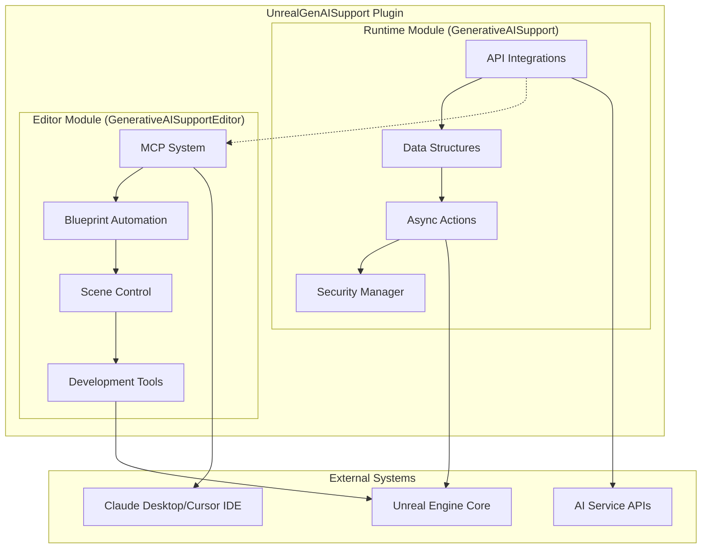

# Architecture Overview

This section provides comprehensive technical documentation for the UnrealGenAISupport plugin architecture, covering the dual-module design, component interactions, and implementation patterns.

## Table of Contents

- [Core Components](Core-Components.md) - Runtime and Editor modules, dependencies, and structure
- [MCP System](MCP-System.md) - Model Control Protocol dual-server architecture
- [API Integration](API-Integration.md) - Async patterns, data structures, and delegates

## High-Level Architecture

UnrealGenAISupport implements a modular architecture designed for both runtime performance and editor-time development capabilities:



## Design Principles

### 1. Separation of Concerns
- **Runtime Module**: Production-ready API integrations, lightweight, no editor dependencies
- **Editor Module**: Development tools, MCP functionality, Blueprint automation

### 2. Async-First Design
- All API calls use `UCancellableAsyncAction` pattern
- Non-blocking operations with proper cancellation support
- Latent Blueprint functions for visual scripting

### 3. Type Safety
- USTRUCT definitions for all data structures
- Enum-based model selection with compile-time validation
- Blueprint reflection system integration

### 4. Extensibility
- Modular API integration pattern
- Plugin-based architecture for easy extension
- Standardized interfaces across AI services

## Core Components Overview

### Runtime Module (GenerativeAISupport)

**Purpose**: Production-ready AI API integrations with Blueprint support

**Key Classes**:
- `UGenOAIChat` - OpenAI API integration
- `UGenClaudeChat` - Anthropic Claude API integration  
- `UGenDSeekChat` - DeepSeek API integration
- `UGenXAIChat` - XAI API integration
- `UGenSecureKey` - API key management

**Dependencies**: Core, CoreUObject, Engine, HTTP, Json, DeveloperSettings, ImageDownload

### Editor Module (GenerativeAISupportEditor)

**Purpose**: Development tools and MCP functionality for AI-controlled Unreal Engine automation

**Key Classes**:
- `UGenBlueprintUtils` - Blueprint creation and manipulation
- `UGenBlueprintNodeCreator` - Node creation and graph management
- `UGenActorUtils` - Scene object control
- `UGenWidgetUtils` - UI widget management

**Dependencies**: Runtime module + UnrealEd, MaterialEditor, BlueprintGraph, UMGEditor, FunctionalTesting

## Communication Patterns

### 1. API Communication (Runtime)
```
C++/Blueprint → AsyncAction → HTTP Request → AI Service API → Response → Delegate Callback
```

### 2. MCP Communication (Editor)
```
Claude Desktop → External MCP Server → Socket (9877) → Internal Unreal Server → Command Handlers → Unreal Engine
```

### 3. Blueprint Integration
```
Blueprint Node → Latent Function → AsyncAction → C++ Implementation → Blueprint Delegate Response
```

## Data Flow Architecture

### API Request Flow
1. **Initiation**: User calls Blueprint node or C++ function
2. **Validation**: Settings validation and API key verification
3. **Serialization**: Convert USTRUCT to JSON format
4. **HTTP Request**: Async HTTP call to AI service
5. **Response Processing**: JSON parsing and error handling
6. **Callback Execution**: Delegate execution with results

### MCP Command Flow
1. **External Request**: Claude Desktop sends MCP command
2. **Command Routing**: External server routes to appropriate handler
3. **Socket Communication**: JSON command sent to Unreal Engine
4. **Handler Execution**: Python handler executes C++ functions
5. **Response Generation**: Result serialized back to external server
6. **Client Response**: Response sent back to Claude Desktop

## Security Architecture

### API Key Management
- Environment variable-based storage (`PS_OPENAIAPIKEY`, etc.)
- Runtime key setting for packaged builds
- No hardcoded keys in source code
- Secure key validation and error handling

### MCP Security
- Localhost-only communication (127.0.0.1:9877)
- PID file process tracking
- Destructive operation confirmation prompts
- Safe script execution with validation

## Performance Considerations

### Runtime Performance
- Async operations prevent blocking
- Configurable HTTP timeouts
- Efficient JSON serialization
- Memory-efficient USTRUCT usage

### Editor Performance  
- MCP operations run on separate thread
- Batch operations for Blueprint node creation
- Efficient socket communication
- Resource cleanup and garbage collection

## Extension Points

### Adding New AI Services
1. Create new data structure (USTRUCT)
2. Implement AsyncAction class
3. Add HTTP request handling
4. Create Blueprint integration
5. Add to plugin module dependencies

### Adding New MCP Commands
1. Define command in external MCP server
2. Create handler in appropriate Python file
3. Implement C++ backend function
4. Add to command routing system
5. Update documentation

## Error Handling Strategy

### API Errors
- Comprehensive error reporting with HTTP status codes
- Structured error responses with detailed messages
- Timeout handling for long-running operations
- Retry logic for transient failures

### MCP Errors
- Command validation and parameter checking
- Safe error propagation to external clients
- Detailed error messages with suggestions
- Graceful fallback for unsupported operations

---

For detailed implementation specifics, see the individual component documentation:
- [Core Components](Core-Components.md) - Module structure and dependencies
- [MCP System](MCP-System.md) - Dual-server architecture details
- [API Integration](API-Integration.md) - Implementation patterns and examples