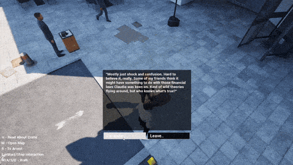
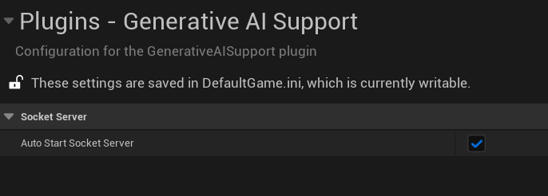
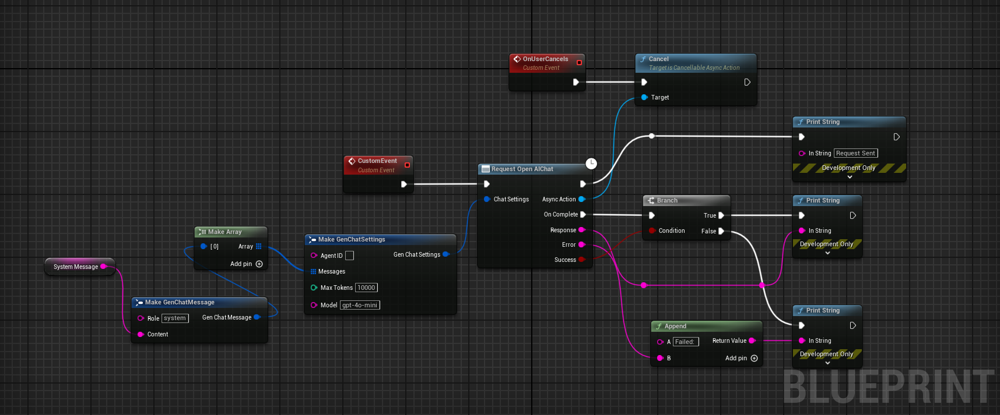
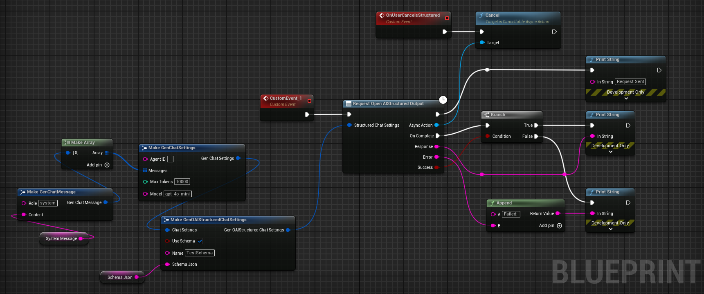
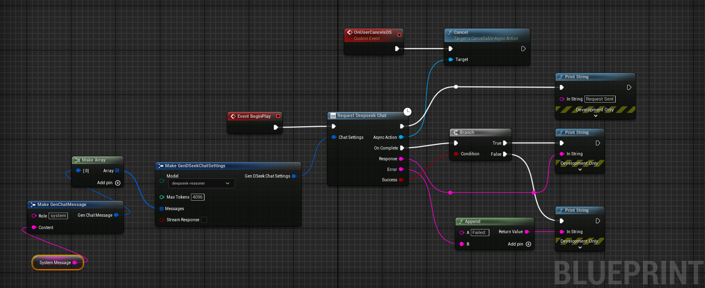
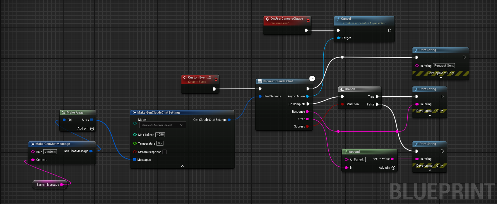
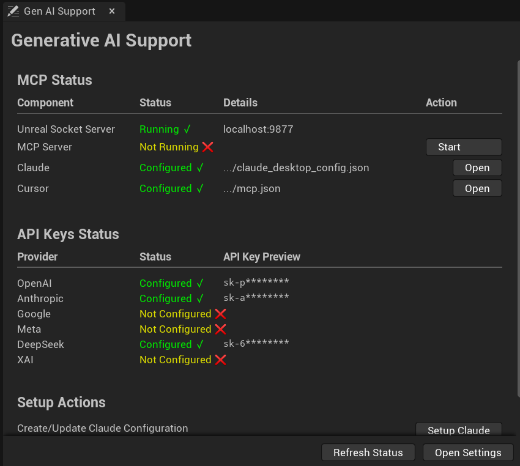

# Unreal Engine Generative AI Support Plugin

## Usage Examples:
#### MCP Example:
Claude spawning scene objects and controlling their transformations and materials, generating blueprints, functions, variables, adding components, running python scripts etc.


#### API Example:
A project called become human, where NPCs are OpenAI agentic instances. Built using this plugin.


> [!WARNING]  
> This plugin is still under rapid development.
> 1) Do not use it in production environments. ⚠️
> 2) Do not use it without version control. ⚠️
> 
> A stable version will be released soon. 🚀🔥

<p align="center"></p>


Every month, hundreds of new AI models are released by various organizations, making it hard to keep up with the latest advancements.

The Unreal Engine Generative AI Support Plugin allows you to focus on game development without worrying about the LLM/GenAI integration layer.

Currently integrating Model Control Protocol (MCP) with Unreal Engine 5.5.

This project aims to build a long-term support (LTS) plugin for various cutting-edge LLM/GenAI models and foster a
community around it. It currently includes OpenAI's GPT-4o, Deepseek R1, Claude Sonnet 4, Claude Opus 4, and GPT-4o-mini for Unreal Engine 5.1 or higher, with plans to add
, real-time APIs, Gemini, MCP, and Grok 3 APIs soon. The plugin will focus exclusively on APIs useful for
game development, evals and interactive experiences. All suggestions and contributions are welcome. The plugin can also be used for setting up new evals and ways to compare models in game battlefields.

## Current Progress:

### LLM/GenAI API Support:

- OpenAI API Support:
    - OpenAI Chat API ✅ 
      [(models-ref)](https://platform.openai.com/docs/models)
        - `gpt-4.1`, `gpt-4.1-mini`, `gpt-4.1-nano` Model ✅
        - `gpt-4o`, `gpt-4o-mini`  Model ✅
        - `o4-mini` Model ✅
        - `o3-mini`, `o1` Model ✅ 
    - OpenAI DALL-E API 🛠️
    - OpenAI Vision API 🛠️
    - OpenAI Realtime API 🛠️
        - `gpt-4o-realtime-preview` `gpt-4o-mini-realtime-preview` Model 🛠️ 
    - OpenAI Structured Outputs ✅
    - OpenAI Whisper API 🚧
- Anthropic Claude API Support:
    - Claude Chat API ✅
        - `claude-sonnet-4-20250514` Model ✅
        - `claude-opus-4-20250514` Model ✅
        - `claude-3-7-sonnet-latest` Model ✅
        - `claude-3-5-sonnet` Model ✅
        - `claude-3-5-haiku-latest` Model ✅
        - `claude-3-opus-latest` Model ✅ 
    - Claude Vision API 🚧
- XAI (Grok 3) API Support:
    - XAI Chat Completions API ✅
        - `grok-3-latest`, `grok-3-mini-beta` Model ✅
        -  Reasoning API 🛠️
    - XAI Image API 🚧
- Google Gemini API Support:
    - Gemini Chat API 🚧🤝
        - `gemini-2.0-flash-lite`, `gemini-2.0-flash` `gemini-1.5-flash` Model 🚧🤝
        - Gemini 2.5 Pro Model🚧🤝
    - Gemini Imagen API: 🚧
      - `imagen-3.0-generate-002` Model 🚧
- Meta AI API Support:
    - Llama 4 herd:
      - Llama 4 Behemoth, Llama 4 Maverick, Llama 4 Scout 🚧🤝
      - llama3.3-70b, llama3.1-8b Model❌
    - Local Llama API 🚧🤝
- Deepseek API Support:
    - Deepseek Chat API ✅
        - `deepseek-chat` (DeepSeek-V3) Model ✅
    - Deepseek Reasoning API, R1 ✅
        - `deepseek-reasoning-r1` Model ✅
        - `deepseek-reasoning-r1` CoT Streaming ❌
    - Independently Hosted Deepseek Models 🚧
- Baidu API Support:
    - Baidu Chat API 🚧
        - `baidu-chat` Model 🚧
- 3D generative model APIs:
    -  TripoSR by StabilityAI 🚧
- Plugin Documentation ✅ [Comprehensive Documentation Hub](Docs/README.md)
- Plugin Example Project 🛠️ [here](https://github.com/prajwalshettydev/unreal-llm-api-test-project)
- Version Control Support
    - Perforce Support 🚧
    - Git Submodule Support ✅ 
- LTS Branching 🚧
    - Stable Branch with Bug Fixes 🚧
    - Dedicated Contributor for LTS 🚧
- Lightweight Plugin (In Builds) 
    - No External Dependencies ✅
    - Build Flags to enable/disable APIs 🚧
    - Submodules per API Organization 🚧
    - Exclude MCP from build 🚧
- Testing 
    - Automated Testing 🚧
    - Different Platforms 🚧🤝
    - Different Engine Versions 🚧🤝

### Unreal MCP (Model Control Protocol):

- Clients Support ✅
    - Claude Desktop App Support ✅
    - Cursor IDE Support ✅
    - OpenAI Operator API Support 🚧
- Blueprints Auto Generation 🛠️
    - Creating new blueprint of types ✅
    - Adding new functions, function/blueprint variables ✅
    - Adding nodes and connections 🛠️ (buggy)
    - Advanced Blueprints Generation 🛠️
- Level/Scene Control for LLMs 🛠️
    - Spawning Objects and Shapes ✅
    - Moving, rotating and scaling objects ✅
    - Changing materials and color ✅
    - Advanced scene features 🛠️
- Generative AI:
    - Prompt to 3D model fetch and spawn 🛠️ 
- Control:
    - Ability to run Python scripts ✅
    - Ability to run Console Commands ✅
- UI:
    - Widgets generation 🛠️
    - UI Blueprint generation 🛠️
- Project Files:
    - Create/Edit project files/folders ️✅
    - Delete existing project files ❌
- Others:
    - Project Cleanup 🛠️ 

Where,
- ✅ - Completed
- 🛠️ - In Progress
- 🚧 - Planned
- 🤝 - Need Contributors
- ❌ - Won't Support For Now

## Table of Contents

- [Setting API Keys](#setting-api-keys)
    - [For Editor](#for-editor)
    - [For Packaged Builds](#for-packaged-builds)
- [Setting up MCP](#setting-up-mcp)
- [Adding the plugin to your project](#adding-the-plugin-to-your-project)
    - [With Git](#with-git)
    - [With Perforce](#with-perforce)
    - [With Unreal Marketplace](#with-unreal-marketplace)
- [Fetching the Latest Plugin Changes](#fetching-the-latest-plugin-changes)
    - [With Git](#with-git-1)
    - [With Perforce](#with-perforce-1)
- [Usage](#usage)
    - [OpenAI](#openai)
        - [1. Chat](#1-chat)
        - [2. Structured Outputs](#2-structured-outputs)
    - [DeepSeek API](#deepseek-api)
        - [1. Chat and Reasoning](#1-chat-and-reasoning)
    - [Anthropic API](#anthropic-api)
        - [1. Chat](#1-chat-1)
    - [XAI's Grok 3 API](#xais-grok-3-api)
        - [1. Chat](#1-chat-2)
    - [Model Control Protocol (MCP)](#model-control-protocol-mcp)
- [Known Issues](#known-issues)
- [Config Window](#config-window)
- [Contribution Guidelines](#contribution-guidelines)
    - [Setting up for Development](#setting-up-for-development)
    - [Project Structure](#project-structure)
- [References](#references)

## Setting API Keys:
> [!NOTE]  
> There is no need to set the API key for testing the MCP features in Claude app. Anthropic key only needed for Claude API.

### For Editor:

Set the environment variable `PS_<ORGNAME>` to your API key.
#### For Windows:
```cmd
setx PS_<ORGNAME> "your api key"
```

#### For Linux/MacOS:

1. Run the following command in your terminal, replacing yourkey with your API key.
    ```bash
    echo "export PS_<ORGNAME>='yourkey'" >> ~/.zshrc
    ```

2. Update the shell with the new variable:
    ```bash
    source ~/.zshrc
    ```

PS: Don't forget to restart the Editor and ALSO the connected IDE after setting the environment variable.

Where `<ORGNAME>` can be:
`PS_OPENAIAPIKEY`, `PS_DEEPSEEKAPIKEY`, `PS_ANTHROPICAPIKEY`, `PS_METAAPIKEY`, `PS_GOOGLEAPIKEY` etc.

### For Packaged Builds:

Storing API keys in packaged builds is a security risk. This is what the OpenAI API documentation says about it:
>"Exposing your OpenAI API key in client-side environments like browsers or mobile apps allows malicious users to take that key and make requests on your behalf – which may lead to unexpected charges or compromise of certain account data. Requests should always be routed through your own backend server where you can keep your API key secure."

Read more about it [here](https://help.openai.com/en/articles/5112595-best-practices-for-api-key-safety).

For test builds you can call the `GenSecureKey::SetGenAIApiKeyRuntime` either in c++ or blueprints function with your API key in the packaged build.

## Setting up MCP:

> [!NOTE]  
> If your project only uses the LLM APIs and not the MCP, you can skip this section.

> [!CAUTION]  
> Discalimer: If you are using the MCP feature of the plugin, it will directly let the Claude Desktop App control your Unreal Engine project.
> Make sure you are aware of the security risks and only use it in a controlled environment.
>
> Please backup your project before using the MCP feature and use version control to track changes.


##### 1. Install any one of the below clients: 
* Claude Desktop App from [here](https://claude.anthropic.com/).
* Cursor IDE from [here](https://www.cursor.com/).

##### 2. Setup the mcp config json:
###### For Claude Desktop App:
`claude_desktop_config.json` file in Claude Desktop App's installation directory. (might ask claude where its located for your platform!)
The file will look something like this:
```json
{
    "mcpServers": {
      "unreal-handshake": {
        "command": "python",
        "args": ["<your_project_directoy_path>/Plugins/GenerativeAISupport/Content/Python/mcp_server.py"],
        "env": {
          "UNREAL_HOST": "localhost",
          "UNREAL_PORT": "9877" 
        }
      }
    }
}
```
###### For Cursor IDE:
`.cursor/mcp.json` file in your project directory. The file will look something like this:
```json
{
    "mcpServers": {
      "unreal-handshake": {
        "command": "python",
        "args": ["<your_project_directoy_path>/Plugins/GenerativeAISupport/Content/Python/mcp_server.py"],
        "env": {
          "UNREAL_HOST": "localhost",
          "UNREAL_PORT": "9877" 
        }
      }
    }
}
```
##### 3. Install MCP[CLI] from with either pip or cv.
```bash
pip install mcp[cli]
```
##### 4. Enable python plugin in Unreal Engine. (Edit -> Plugins -> Python Editor Script Plugin)

##### 5. [OPTIONAL] Enable AutoStart MCP server on editor open




## Adding the plugin to your project:

### With Git:

1. Add the Plugin Repository as a Submodule in your project's repository.

   ```cmd
   git submodule add https://github.com/prajwalshettydev/UnrealGenAISupport Plugins/GenerativeAISupport
   ```

2. Regenerate Project Files:
   Right-click your .uproject file and select Generate Visual Studio project files.
3. Enable the Plugin in Unreal Editor:
   Open your project in Unreal Editor. Go to Edit > Plugins. Search for the Plugin in the list and enable it.
4. For Unreal C++ Projects, include the Plugin's module in your project's Build.cs file:

   ```cpp
   PrivateDependencyModuleNames.AddRange(new string[] { "GenerativeAISupport" });
   ```

### With Perforce:

Still in development..

### With Unreal Marketplace:
Coming soon, for free, in the Unreal Engine Marketplace.

## Fetching the Latest Plugin Changes:

### With Git:

you can pull the latest changes with:

```cmd
cd Plugins/GenerativeAISupport
git pull origin main
```

Or update all submodules in the project:

```cmd
git submodule update --recursive --remote
```

### With Perforce:

Still in development..

## Usage:
There is a example Unreal project that already implements the plugin. You can find it [here](https://github.com/prajwalshettydev/unreal-llm-api-test-project).

### OpenAI:

Currently the plugin supports Chat and Structured Outputs from OpenAI API. Both for C++ and Blueprints.
Tested models are `gpt-4o`, `gpt-4o-mini`, `gpt-4.5`, `o1-mini`, `o1`, `o3-mini-high`.

#### 1. Chat:

   ##### C++ Example:
```cpp
    void SomeDebugSubsystem::CallGPT(const FString& Prompt, 
        const TFunction<void(const FString&, const FString&, bool)>& Callback)
    {
        FGenChatSettings ChatSettings;
        ChatSettings.Model = TEXT("gpt-4o-mini");
        ChatSettings.MaxTokens = 500;
        ChatSettings.Messages.Add(FGenChatMessage{ TEXT("system"), Prompt });
    
        FOnChatCompletionResponse OnComplete = FOnChatCompletionResponse::CreateLambda(
            [Callback](const FString& Response, const FString& ErrorMessage, bool bSuccess)
        {
            Callback(Response, ErrorMessage, bSuccess);
        });
    
        UGenOAIChat::SendChatRequest(ChatSettings, OnComplete);
    }
```

   ##### Blueprint Example:



#### 2. Structured Outputs:
   ##### C++ Example 1:
   Sending a custom schema json directly to function call
   ```cpp
   FString MySchemaJson = R"({
   "type": "object",
   "properties": {
       "count": {
           "type": "integer",
           "description": "The total number of users."
       },
       "users": {
           "type": "array",
           "items": {
               "type": "object",
               "properties": {
                   "name": { "type": "string", "description": "The user's name." },
                   "heading_to": { "type": "string", "description": "The user's destination." }
               },
               "required": ["name", "role", "age", "heading_to"]
           }
       }
   },
   "required": ["count", "users"]
   })";
   
   UGenAISchemaService::RequestStructuredOutput(
       TEXT("Generate a list of users and their details"),
       MySchemaJson,
       [](const FString& Response, const FString& Error, bool Success) {
          if (Success)
          {
              UE_LOG(LogTemp, Log, TEXT("Structured Output: %s"), *Response);
          }
          else
          {
              UE_LOG(LogTemp, Error, TEXT("Error: %s"), *Error);
          }
       }
   );
   ```
   ##### C++ Example 2:
   Sending a custom schema json from a file
   ```cpp
   #include "Misc/FileHelper.h"
   #include "Misc/Paths.h"
   FString SchemaFilePath = FPaths::Combine(
       FPaths::ProjectDir(),
       TEXT("Source/:ProjectName/Public/AIPrompts/SomeSchema.json")
   );
   
   FString MySchemaJson;
   if (FFileHelper::LoadFileToString(MySchemaJson, *SchemaFilePath))
   {
       UGenAISchemaService::RequestStructuredOutput(
           TEXT("Generate a list of users and their details"),
           MySchemaJson,
           [](const FString& Response, const FString& Error, bool Success) {
              if (Success)
              {
                  UE_LOG(LogTemp, Log, TEXT("Structured Output: %s"), *Response);
              }
              else
              {
                  UE_LOG(LogTemp, Error, TEXT("Error: %s"), *Error);
              }
           }
       );
   }
   ```

##### Blueprint Example:


### DeepSeek API:

Currently the plugin supports Chat and Reasoning from DeepSeek API. Both for C++ and Blueprints.
Points to note:
* System messages are currently mandatory for the reasoning model. API otherwise seems to return null
* Also, from the documentation: "Please note that if the reasoning_content field is included in the sequence of input messages, the API will return a 400 error.
  Read more about it [here](https://api-docs.deepseek.com/guides/reasoning_model)"

> [!WARNING]  
> While using the R1 reasoning model, make sure the Unreal's HTTP timeouts are not the default values at 30 seconds.
> As these API calls can take longer than 30 seconds to respond. Simply setting the `HttpRequest->SetTimeout(<N Seconds>);` is not enough
> So the following lines need to be added to your project's `DefaultEngine.ini` file:
> ```ini
> [HTTP]
> HttpConnectionTimeout=180
> HttpReceiveTimeout=180
> ```

#### 1. Chat and Reasoning:
##### C++ Example:

   ```cpp
    FGenDSeekChatSettings ReasoningSettings;
    ReasoningSettings.Model = EDeepSeekModels::Reasoner; // or EDeepSeekModels::Chat for Chat API
    ReasoningSettings.MaxTokens = 100;
    ReasoningSettings.Messages.Add(FGenChatMessage{TEXT("system"), TEXT("You are a helpful assistant.")});
    ReasoningSettings.Messages.Add(FGenChatMessage{TEXT("user"), TEXT("9.11 and 9.8, which is greater?")});
    ReasoningSettings.bStreamResponse = false;
    UGenDSeekChat::SendChatRequest(
        ReasoningSettings,
        FOnDSeekChatCompletionResponse::CreateLambda(
            [this](const FString& Response, const FString& ErrorMessage, bool bSuccess)
            {
                if (!UTHelper::IsContextStillValid(this))
                {
                    return;
                }

                // Log response details regardless of success
                UE_LOG(LogTemp, Warning, TEXT("DeepSeek Reasoning Response Received - Success: %d"), bSuccess);
                UE_LOG(LogTemp, Warning, TEXT("Response: %s"), *Response);
                if (!ErrorMessage.IsEmpty())
                {
                    UE_LOG(LogTemp, Error, TEXT("Error Message: %s"), *ErrorMessage);
                }
            })
    );
   ```

##### Blueprint Example:


### Anthropic API:
Currently the plugin supports Chat from Anthropic API. Both for C++ and Blueprints.
Tested models are `claude-sonnet-4-20250514`, `claude-opus-4-20250514`, `claude-3-7-sonnet-latest`, `claude-3-5-sonnet`, `claude-3-5-haiku-latest`, `claude-3-opus-latest`.

#### 1. Chat:
##### C++ Example:
```cpp
    // ---- Claude Chat Test ----
    FGenClaudeChatSettings ChatSettings;
    ChatSettings.Model = EClaudeModels::Claude_3_7_Sonnet; // Use Claude 3.7 Sonnet model
    ChatSettings.MaxTokens = 4096;
    ChatSettings.Temperature = 0.7f;
    ChatSettings.Messages.Add(FGenChatMessage{TEXT("system"), TEXT("You are a helpful assistant.")});
    ChatSettings.Messages.Add(FGenChatMessage{TEXT("user"), TEXT("What is the capital of France?")});
    
    UGenClaudeChat::SendChatRequest(
        ChatSettings,
        FOnClaudeChatCompletionResponse::CreateLambda(
            [this](const FString& Response, const FString& ErrorMessage, bool bSuccess)
            {
                if (!UTHelper::IsContextStillValid(this))
                {
                    return;
                }
    
                if (bSuccess)
                {
                    UE_LOG(LogTemp, Warning, TEXT("Claude Chat Response: %s"), *Response);
                }
                else
                {
                    UE_LOG(LogTemp, Error, TEXT("Claude Chat Error: %s"), *ErrorMessage);
                }
            })
    );
```

##### Blueprint Example:


### XAI's Grok 3 API:
Currently the plugin supports Chat from XAI's Grok 3 API. Both for C++ and Blueprints.

#### 1. Chat:
```cpp
	FGenXAIChatSettings ChatSettings;
	ChatSettings.Model = TEXT("grok-3-latest");
		ChatSettings.Messages.Add(FGenXAIMessage{
		TEXT("system"),
		TEXT("You are a helpful AI assistant for a game. Please provide concise responses.")
	});
	ChatSettings.Messages.Add(FGenXAIMessage{TEXT("user"), TEXT("Create a brief description for a forest level in a fantasy game")});
	ChatSettings.MaxTokens = 1000;

	UGenXAIChat::SendChatRequest(
		ChatSettings,
		FOnXAIChatCompletionResponse::CreateLambda(
			[this](const FString& Response, const FString& ErrorMessage, bool bSuccess)
			{
				if (!UTHelper::IsContextStillValid(this))
				{
					return;
				}
				
				UE_LOG(LogTemp, Warning, TEXT("XAI Chat response: %s"), *Response);
				
				if (!bSuccess)
				{
					UE_LOG(LogTemp, Error, TEXT("XAI Chat error: %s"), *ErrorMessage);
				}
			})
	);
```

## Model Control Protocol (MCP):
This is currently work in progress. The plugin supports various clients like Claude Desktop App, Cursor etc.
### Usage:

#### If Autostart MCP server is enabled: (In plugin's settings)
##### 1. Open the Unreal Engine Editor.
##### 2. Open the Claude Desktop App or Cursor IDE or Windsor. 

That's it! You can now use the MCP features of the plugin.

#### If Autostart MCP server is disabled:

##### 1. Run the MCP server from the plugin's python directory.
```bash
python <your_project_directoy>/Plugins/GenerativeAISupport/Content/Python/mcp_server.py
```
##### 2. Run the MCP client by opening or restarting the Claude desktop app or Cursor IDE.

##### 3. Open a new Unreal Engine project and run the below python script from the plugin's python directory.

> Tools -> Run Python Script -> Select the `Plugins/GenerativeAISupport/Content/Python/unreal_socket_server.py` file.

#### 4. Now you should be able to prompt the Claude Desktop App to use Unreal Engine.

## Known Issues:
- Nodes fail to connect properly with MCP
- No undo redo support for MCP
- No streaming support for Deepseek reasoning model
- No complex material generation support for the create material tool
- Issues with running some llm generated valid python scripts
- When LLM compiles a blueprint no proper error handling in its response
- Issues spawning certain nodes, especially with getters and setters
- Doesn't open the right context window during scene and project files edit. 
- Doesn't dock the window properly in the editor for blueprints.

## Config Window:
(Still wip)


## Contribution Guidelines:

### Setting up for Development:

Please refer to our comprehensive [Contributing Guidelines](Docs/Contributing/README.md) for detailed setup instructions, coding standards, and development workflow.

### Project Structure:

Detailed project structure and architecture documentation is available in the [Documentation Hub](Docs/README.md).

## References:

* Env Var set logic
  from: [OpenAI-Api-Unreal by KellanM](https://github.com/KellanM/OpenAI-Api-Unreal/blob/main/Source/OpenAIAPI/Private/OpenAIUtils.cpp)
* MCP Server inspiration
  from: [Blender-MCP by ahujasid](https://github.com/ahujasid/blender-mcp)


## 📚 Documentation

### [📖 Complete Documentation Hub](Docs/README.md)

Access our comprehensive documentation covering all aspects of the UnrealGenAISupport plugin:

- **🏗️ [Architecture](Docs/Architecture/README.md)** - Technical architecture, core components, and system design
- **🔌 [API Integrations](Docs/API/README.md)** - Complete guides for OpenAI, Anthropic, DeepSeek, and XAI
- **🤖 [Model Control Protocol](Docs/MCP/README.md)** - MCP setup, tools, and troubleshooting
- **🤝 [Contributing](Docs/Contributing/README.md)** - Development setup, coding standards, and contribution guidelines

### Quick Navigation

| Topic | Description | Link |
|-------|-------------|------|
| **Getting Started** | New to the plugin? Start here | [Development Setup](Docs/Contributing/Development-Setup.md) |
| **API Integration** | Add AI to your project | [API Guide](Docs/API/README.md) |
| **MCP Control** | Let AI control Unreal Engine | [MCP Setup](Docs/MCP/Server-Setup.md) |
| **Contributing** | Help improve the plugin | [Contributing Guide](Docs/Contributing/README.md) |
| **Architecture** | Understand the design | [Architecture Overview](Docs/Architecture/README.md) |

## Quick Links:

- [OpenAI API Documentation](https://platform.openai.com/docs/api-reference)
- [Anthropic API Documentation](https://docs.anthropic.com/en/docs/about-claude/models)
- [XAI API Documentation](https://docs.x.ai/api)
- [Google Gemini API Documentation](https://ai.google.dev/gemini-api/docs/models/gemini)
- [Meta AI API Documentation](https://docs.llama-api.com/quickstart#available-models)
- [Deepseek API Documentation](https://api-docs.deepseek.com/)
- [Model Control Protocol (MCP) Documentation](https://modelcontextprotocol.io/)
- [TripoSt Documentation](https://huggingface.co/stabilityai/TripoSR)

## Support This Project

<iframe src="https://github.com/sponsors/prajwalshettydev/button" title="Sponsor prajwalshettydev" height="32" width="114" style="border: 0; border-radius: 6px;"></iframe>

If you find UnrealGenAISupport helpful, consider sponsoring me to keep the project going! Click the "Sponsor" button above to contribute.
