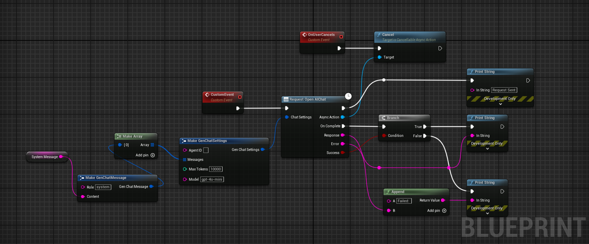

# Unreal Engine Generative AI Support Plugin

> [!WARNING]  
> This plugin is currently under development and not ready for production use.

This project aims to build a long-term support (LTS) plugin for various cutting-edge LLM/GenAI models & foster a
community around it. It currently includes OpenAI's GPT4o & GPT4o-mini for Unreal Engine 5.1 or higher, with plans to add Claude
Sonnet 3.5, real-time APIs, Deepseek, Gemini, & Grok 2 APIs soon. Will only focus on the APIs that can be useful for
game development and interactive experiences. Any suggestions
and contributions are welcome. Currently working on OpenAI API support with real-time chat/audio completions.

## Current Progress:

- OpenAI API Support:
    - OpenAI Chat API ✅
        - `gpt-4o` Model ✅
        - `gpt-4o-mini` Model ✅
        - `o1-mini` Model 🚧
        - `o1` Model 🚧
    - OpenAI DALL-E API 🛠️
    - OpenAI Vision API 🚧
    - OpenAI Realtime API 🛠️
    - OpenAI Structured Outputs ✅
    - OpenAI Text-To-Speech API 🚧
    - OpenAI Whisper API 🚧
- Anthropic Claude API Support:
    - Claude Chat API 🚧
        - `claude-3-5-sonnet-latest` Model 🚧
        - `claude-3-5-haiku-latest` Model 🚧
        - `claude-3-opus-latest` Model 🚧
    - Claude Vision API 🚧
- XAI (Grok) API Support:
    - XAI Chat Completions API 🚧
        - `grok-beta` Model 🚧
        - `grok-beta` Streaming API 🚧
    - XAI Image API 🚧
- Google Gemini API Support:
    - Gemini Chat API 🚧🤝
        - `gemini-2.0-flash-exp` Model 🚧🤝
        - `gemini-1.5-flash` Model 🚧🤝
        - `gemini-1.5-flash-8b` Model 🚧🤝
    - Gemini Multi-Modal API 🚧🤝
- Meta AI API Support:
    - Llama Chat API 🚧
        - `llama3.3-70b` Model 🚧
        - `llama3.1-8b` Model 🚧
    - Multi-Modal Vision API 🚧
        - `llama3.2-90b-vision` Model 🚧
    - Local Llama API 🚧🤝
- Deepseek API Support:
    - Deepseek Chat API 🚧
        - `deepseek-chat` (DeepSeek-V3) Model 🚧
- API Key Management 
    - Cross-Platform Secure Key Storage ✅
    - Encrypted Key Storage 🛠️
    - Cross Platform Testing 🚧
    - Build System Integration 🛠️
    - Keys in Build Configuration 🛠️
- Unreal Engine Integration
    - Blueprint Support 🛠️
    - C++ Support 🛠️
    - C++ Latent Functions For Blueprints 🛠️
    - Packaged Build Support 🛠️
- Plugin Documentation 🛠️🤝
- Plugin Example Project 🛠️ [here](https://github.com/prajwalshettydev/unreal-llm-api-test-project)
- Version Control Support
    - Perforce Support 🚧
    - Git Submodule Support ✅ 
- LTS Branching 🚧
    - Stable Branch with Bug Fixes 🚧
    - Dedicated Contributor for LTS 🚧
- Lightweight Plugin (In Builds) 
    - No External Dependencies ✅
    - Build Flags to enable/disable APIs 🚧
    - Submodules per API Organization 🚧
- Testing 
    - Automated Testing 🚧
    - Build Testing 🚧
    - Different Platforms 🚧🤝
    - Different Engine Versions 🚧🤝


Where,
- ✅ - Completed
- 🛠️ - In Progress
- 🚧 - Planned
- 🤝 - Need Contributors

## Quick Links:

- [OpenAI API Documentation](https://platform.openai.com/docs/api-reference)
- [Anthropic API Documentation](https://docs.anthropic.com/en/docs/about-claude/models)
- [XAI API Documentation](https://docs.x.ai/api)
- [Google Gemini API Documentation](https://ai.google.dev/gemini-api/docs/models/gemini)
- [Meta AI API Documentation](https://docs.llama-api.com/quickstart#available-models)
- [Deepseek API Documentation](https://api-docs.deepseek.com/)

## Setting API Key:

### For Editor:

Set the environment variable `PS_OPENAIAPIKEY` to your API key.
In windows you can use:

```cmd
setx PS_OPENAIAPIKEY "your api key"
```

In Linux/MacOS you can use:

1. Run the following command in your terminal, replacing yourkey with your API key.
    ```bash
    echo "export PS_OPENAIAPIKEY='yourkey'" >> ~/.zshrc
    ```

2. Update the shell with the new variable:
    ```bash
    source ~/.zshrc
    ```


### For Packaged Builds:

Storing API keys in packaged builds is a security risk. This is what the OpenAI API documentation says about it:
>"Exposing your OpenAI API key in client-side environments like browsers or mobile apps allows malicious users to take that key and make requests on your behalf – which may lead to unexpected charges or compromise of certain account data. Requests should always be routed through your own backend server where you can keep your API key secure."

Read more about it [here](https://help.openai.com/en/articles/5112595-best-practices-for-api-key-safety).

## Adding the plugin to your project:

### With Git:

1. Add the Plugin Repository as a Submodule in your project's repository.

   ```cmd
   git submodule add https://github.com/prajwalshettydev/UnrealGenAISupport Plugins/GenerativeAISupport
   ```

2. Regenerate Project Files:
   Right-click your .uproject file and select Generate Visual Studio project files.
3. Enable the Plugin in Unreal Editor:
   Open your project in Unreal Editor. Go to Edit > Plugins. Search for the Plugin in the list and enable it.
4. For Unreal C++ Projects, include the Plugin's module in your project's Build.cs file:

   ```cpp
   PrivateDependencyModuleNames.AddRange(new string[] { "GenerativeAISupport" });
   ```

### With Perforce:

Still in development..

## Fetching the Latest Plugin Changes:

### With Git:

you can pull the latest changes with:

```cmd
cd Plugins/GenerativeAISupport
git pull origin main
```

Or update all submodules in the project:

```cmd
git submodule update --recursive --remote
```

### With Perforce:

Still in development..

## Usage:

### OpenAI:

Function `GetGenerativeAIApiKey` by default responds with OpenAI API key, that you have securely set in the local
environment variable

1. Chat:

   C++ Example:
    ```cpp
    void SomeDebugSubsystem::CallGPT(const FString& Prompt, 
        const TFunction<void(const FString&, const FString&, bool)>& Callback)
    {
        FGenChatSettings ChatSettings;
        ChatSettings.Model = TEXT("gpt-4o-mini");
        ChatSettings.MaxTokens = 500;
        ChatSettings.Messages.Add(FGenChatMessage{ TEXT("system"), Prompt });
    
        FOnChatCompletionResponse OnComplete = FOnChatCompletionResponse::CreateLambda(
            [Callback](const FString& Response, const FString& ErrorMessage, bool bSuccess)
        {
            Callback(Response, ErrorMessage, bSuccess);
        });
    
        UGenOAIChat::SendChatRequest(ChatSettings, OnComplete);
    }
    ```

   Blueprint Example:

    
2. Structured Outputs:
   C++ Example 1:
   Sending a custom schema json directly to function call
   ```cpp
   FString MySchemaJson = R"({
   "type": "object",
   "properties": {
       "count": {
           "type": "integer",
           "description": "The total number of users."
       },
       "users": {
           "type": "array",
           "items": {
               "type": "object",
               "properties": {
                   "name": { "type": "string", "description": "The user's name." },
                   "heading_to": { "type": "string", "description": "The user's destination." }
               },
               "required": ["name", "role", "age", "heading_to"]
           }
       }
   },
   "required": ["count", "users"]
   })";
   
   UGenAISchemaService::RequestStructuredOutput(
       TEXT("Generate a list of users and their details"),
       MySchemaJson,
       [](const FString& Response, const FString& Error, bool Success) {
          if (Success)
          {
              UE_LOG(LogTemp, Log, TEXT("Structured Output: %s"), *Response);
          }
          else
          {
              UE_LOG(LogTemp, Error, TEXT("Error: %s"), *Error);
          }
       }
   );
   ```
   C++ Example 2:
   Sending a custom schema json from a file
   ```cpp
   #include "Misc/FileHelper.h"
   #include "Misc/Paths.h"
   FString SchemaFilePath = FPaths::Combine(
       FPaths::ProjectDir(),
       TEXT("Source/:ProjectName/Public/AIPrompts/SomeSchema.json")
   );
   
   FString MySchemaJson;
   if (FFileHelper::LoadFileToString(MySchemaJson, *SchemaFilePath))
   {
       UGenAISchemaService::RequestStructuredOutput(
           TEXT("Generate a list of users and their details"),
           MySchemaJson,
           [](const FString& Response, const FString& Error, bool Success) {
              if (Success)
              {
                  UE_LOG(LogTemp, Log, TEXT("Structured Output: %s"), *Response);
              }
              else
              {
                  UE_LOG(LogTemp, Error, TEXT("Error: %s"), *Error);
              }
           }
       );
   }
   ```
## Contribution Guidelines:
### Project Structure:


## References:

* Env Var set logic
  from: [OpenAI-Api-Unreal by KellanM](https://github.com/KellanM/OpenAI-Api-Unreal/blob/main/Source/OpenAIAPI/Private/OpenAIUtils.cpp)